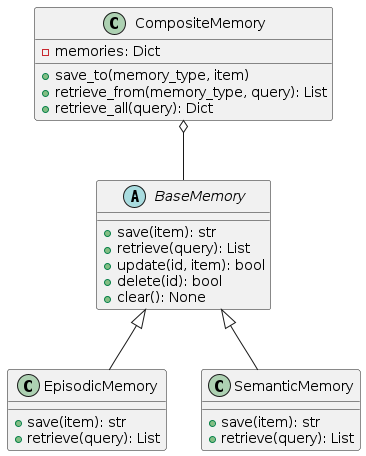

# Memory System

The memory system enables agents to store, retrieve, and utilize information across interactions. It provides different types of memory appropriate for different kinds of knowledge and use cases.



## Overview

The memory system is designed around cognitive science principles, implementing three primary memory types:

- **Episodic Memory**: Stores experiences and events (what happened)
- **Semantic Memory**: Stores facts and knowledge (what is known)
- **Procedural Memory**: Stores skills and procedures (how to do things)

These memory types are combined through a unified interface that allows agents to seamlessly access and update information.

## Core Components

### BaseMemory

`BaseMemory` is the abstract base class that defines the common interface for all memory types:

- **`save(item, **metadata)`**: Store an item in memory with metadata
- **`retrieve(query, limit, **filters)`**: Retrieve items matching a query
- **`update(id, item, **metadata)`**: Update an existing memory item
- **`delete(id)`**: Remove an item from memory
- **`clear()`**: Clear all items in this memory

Each memory implementation provides both asynchronous and synchronous versions of these methods.

### CompositeMemory

`CompositeMemory` is a container that manages multiple memory types and provides a unified interface:

- **`save_to(memory_type, item, **metadata)`**: Save to a specific memory type
- **`retrieve_from(memory_type, query, limit, **filters)`**: Retrieve from a specific memory type
- **`retrieve_all(query, limits, filters)`**: Retrieve from all memory types
- **`update_in(memory_type, id, item, **metadata)`**: Update in a specific memory type
- **`delete_from(memory_type, id)`**: Delete from a specific memory type
- **`clear_all()`**: Clear all memories
- **`clear_type(memory_type)`**: Clear a specific memory type

### Memory Persistence

The `MemoryPersistence` abstract interface provides storage backends for memory:

- **`initialize()`**: Set up the persistence layer
- **`store(namespace, key, value, metadata)`**: Store a value
- **`retrieve(namespace, key)`**: Retrieve a value by key
- **`search(namespace, query, limit, **filters)`**: Search for values
- **`delete(namespace, key)`**: Delete a value
- **`clear_namespace(namespace)`**: Clear all data in a namespace

Implementations include:
- **`InMemoryPersistence`**: Volatile in-process storage
- **`FilePersistence`**: File-based persistent storage
- **`VectorStorePersistence`**: Vector database for semantic search

## Memory Types

### Episodic Memory

Episodic memory stores experiences, events, and interactions. It's useful for:

- Remembering conversations with users
- Tracking tool usage history
- Recording action sequences
- Storing timestamps and context of events

```python
# Example episodic memory item
{
    "timestamp": "2023-06-15T14:32:45",
    "content": "User asked about weather in Paris",
    "importance": 0.7,
    "tags": ["interaction", "weather", "location"]
}
```

### Semantic Memory

Semantic memory stores facts, knowledge, and information. It's useful for:

- User preferences and information
- Domain knowledge
- Entity relationships
- Conceptual information

```python
# Example semantic memory item
{
    "entity": "user",
    "attribute": "preferred_language",
    "value": "Spanish",
    "confidence": 0.9,
    "source": "explicit_statement"
}
```

### Procedural Memory

Procedural memory stores skills, procedures, and patterns. It's useful for:

- Storing successful solution approaches
- Recording tool usage patterns
- Remembering effective prompt structures
- Saving execution plans for similar problems

```python
# Example procedural memory item
{
    "name": "weather_lookup_procedure",
    "description": "Process for checking weather by location",
    "steps": [
        "Extract location from query",
        "Call weather_api with location parameter",
        "Format response with temperature and conditions"
    ],
    "success_rate": 0.95
}
```

## Implementation Guide

### Basic Memory Setup

```python
from agent_patterns.core.memory import (
    CompositeMemory, 
    EpisodicMemory, 
    SemanticMemory, 
    ProceduralMemory
)
from agent_patterns.core.memory.persistence import InMemoryPersistence
import asyncio

# Create persistence backend
persistence = InMemoryPersistence()
asyncio.run(persistence.initialize())

# Create memory types
episodic = EpisodicMemory(persistence, namespace="user123_episodic")
semantic = SemanticMemory(persistence, namespace="user123_semantic")
procedural = ProceduralMemory(persistence, namespace="user123_procedural")

# Create composite memory
memory = CompositeMemory({
    "episodic": episodic,
    "semantic": semantic,
    "procedural": procedural
})
```

### Saving to Memory

```python
# Save to episodic memory
asyncio.run(memory.save_to(
    "episodic",
    {
        "content": "User asked about the capital of France",
        "importance": 0.6,
        "tags": ["geography", "question"]
    }
))

# Save to semantic memory
asyncio.run(memory.save_to(
    "semantic",
    {
        "entity": "France", 
        "attribute": "capital", 
        "value": "Paris"
    }
))

# Save to procedural memory
asyncio.run(memory.save_to(
    "procedural",
    {
        "name": "capital_lookup",
        "description": "Process for finding country capitals",
        "steps": ["Search for 'capital of {country}'", "Extract city name"]
    }
))
```

### Retrieving from Memory

```python
# Retrieve from episodic memory
episodes = asyncio.run(memory.retrieve_from(
    "episodic",
    "France",  # Query
    limit=5
))

# Retrieve from semantic memory
facts = asyncio.run(memory.retrieve_from(
    "semantic",
    "France",  # Query
    limit=10
))

# Retrieve from all memory types
all_memories = asyncio.run(memory.retrieve_all(
    "France",  # Query
    limits={"episodic": 3, "semantic": 5, "procedural": 2}
))
```

### Integrating with Agents

```python
from agent_patterns.patterns import ReActAgent

# Configure the agent with memory
agent = ReActAgent(
    llm_configs=llm_configs,
    memory=memory,
    memory_config={
        "episodic": True,   # Enable episodic memory
        "semantic": True,   # Enable semantic memory
        "procedural": False  # Disable procedural memory
    }
)

# The agent will automatically:
# 1. Retrieve relevant memories before processing
# 2. Save important information after interactions
result = agent.run("Tell me about France")
```

## Advanced Usage

### Memory Filtering

```python
# Retrieve with filters
episodes = asyncio.run(memory.retrieve_from(
    "episodic",
    "question",
    limit=10,
    importance_min=0.5,  # Only items with importance >= 0.5
    tags=["geography"]   # Only items with the geography tag
))
```

### Memory Updates

```python
# Update an existing memory item
asyncio.run(memory.update_in(
    "semantic",
    "france_capital_id",  # The memory ID
    {
        "entity": "France",
        "attribute": "capital",
        "value": "Paris",
        "confidence": 1.0  # Updated confidence
    }
))
```

### Persistence Options

```python
# File-based persistence
from agent_patterns.core.memory.persistence import FilePersistence

file_persistence = FilePersistence("./memory_data")
asyncio.run(file_persistence.initialize())

# Vector store persistence (requires extra dependencies)
from agent_patterns.core.memory.persistence import VectorStorePersistence

vector_persistence = VectorStorePersistence("memory_vectors")
asyncio.run(vector_persistence.initialize())
```

## Design Considerations

The memory system is designed with these principles:

1. **Cognitive Science Foundation**: Models human memory types
2. **Separation of Interface and Implementation**: Clear abstractions
3. **Persistence Flexibility**: Multiple storage options
4. **Type Safety**: Generic type parameters for compile-time checking
5. **Async-First**: Native async support with sync wrappers

## Related Documentation

- [Base Agent](base_agent.md)
- [Tool System](tools.md)
- [Memory and MCP Integration](../memory_and_mcp_integration.md)