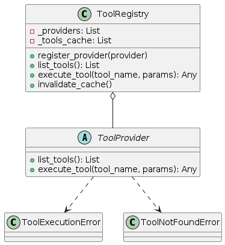
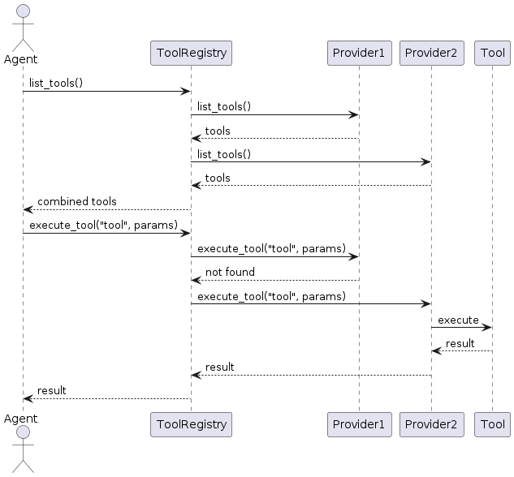

# Tool System

The tool system enables agents to interact with external systems, APIs, and capabilities. It provides a unified interface for tool discovery, execution, and management.



## Overview

The tool system is designed around these key concepts:

- **Tool**: A function or capability that an agent can use
- **Tool Provider**: A source of tools that can be discovered and executed
- **Tool Registry**: A central registry that manages multiple tool providers

This design allows agents to work with tools from different sources through a consistent interface, whether they're local functions, remote APIs, or MCP-compatible services.

## Core Components

### ToolProvider

`ToolProvider` is the abstract base interface that all tool providers must implement:

- **`list_tools()`**: Return a list of available tools with metadata
- **`execute_tool(tool_name, params)`**: Execute a tool with the provided parameters

Each tool provider is responsible for managing its own set of tools and handling tool execution.

### ToolRegistry

`ToolRegistry` manages multiple tool providers and provides a unified interface:

- **`register_provider(provider)`**: Add a new tool provider
- **`list_tools()`**: List all tools from all registered providers
- **`execute_tool(tool_name, params)`**: Execute a tool by name
- **`invalidate_cache()`**: Clear the tools cache to refresh available tools

The registry handles routing tool execution requests to the appropriate provider and maintains a cache of available tools for efficiency.

### MCPToolProvider

`MCPToolProvider` is an implementation of `ToolProvider` that connects to MCP-compatible servers:

- Supports the Model Context Protocol for standardized tool interaction
- Allows connecting to multiple MCP servers
- Handles serialization/deserialization of tool parameters and results
- Provides error handling and retry logic

## Tool Specifications

Tools are specified with standard metadata:

```python
{
    "name": "search",
    "description": "Search for information on the web",
    "parameters": {
        "type": "object",
        "properties": {
            "query": {
                "type": "string",
                "description": "The search query"
            }
        },
        "required": ["query"]
    }
}
```

This format is compatible with:
- OpenAI Function Calling
- Anthropic Tool Use
- LangChain Tools
- Model Context Protocol

## Tool Execution

When a tool is executed:

1. The agent calls `execute_tool(tool_name, params)`
2. The registry routes the request to the appropriate provider
3. The provider handles parameter validation and execution
4. The result is returned to the agent
5. The agent incorporates the result into its reasoning



## Implementation Guide

### Basic Tools Setup

```python
from agent_patterns.core.tools import ToolRegistry
from langchain.tools import tool

# Define simple tools using LangChain's @tool decorator
@tool
def search(query: str) -> str:
    """Search for information on the web."""
    # In a real implementation, this would access a search API
    return f"Results for {query}: Some relevant information..."

@tool
def calculator(expression: str) -> str:
    """Calculate a mathematical expression."""
    try:
        return f"Result: {eval(expression)}"
    except Exception as e:
        return f"Error: {str(e)}"

# Create a tool registry with these tools
tool_registry = ToolRegistry([search, calculator])
```

### Integrating with Agents

```python
from agent_patterns.patterns import ReActAgent

# Configure the agent with tools
agent = ReActAgent(
    llm_configs=llm_configs,
    tool_provider=tool_registry
)

# The agent will automatically:
# 1. Discover available tools
# 2. Use tools when appropriate
# 3. Process tool results
result = agent.run("What is 25 * 16?")
```

### Using MCP Tools

```python
from agent_patterns.core.tools.providers.mcp_provider import (
    MCPToolProvider, 
    create_mcp_server_connection
)

# Create MCP server connections
mcp_servers = [
    create_mcp_server_connection(
        "http", 
        {"url": "http://localhost:8000/mcp"}
    ),
    create_mcp_server_connection(
        "stdio", 
        {
            "command": ["python", "mcp_servers/calculator_server.py"],
            "working_dir": "./examples"
        }
    )
]

# Create MCP tool provider
mcp_provider = MCPToolProvider(mcp_servers)

# Create a registry that combines local and MCP tools
registry = ToolRegistry([search])  # Start with local tool
registry.register_provider(mcp_provider)  # Add MCP provider

# Use with agent
agent = ReActAgent(
    llm_configs=llm_configs,
    tool_provider=registry
)

result = agent.run("Calculate 35 * 12 and search for information about the result.")
```

## Advanced Usage

### Custom Tool Provider

```python
from agent_patterns.core.tools.base import ToolProvider, ToolNotFoundError, ToolExecutionError

class MyCustomToolProvider(ToolProvider):
    def __init__(self):
        self.tools = {
            "random_number": {
                "name": "random_number",
                "description": "Generate a random number in a range",
                "parameters": {
                    "type": "object",
                    "properties": {
                        "min": {"type": "number"},
                        "max": {"type": "number"}
                    },
                    "required": ["min", "max"]
                }
            }
        }
    
    def list_tools(self) -> List[Dict[str, Any]]:
        return list(self.tools.values())
    
    def execute_tool(self, tool_name: str, params: Dict[str, Any]) -> Any:
        if tool_name not in self.tools:
            raise ToolNotFoundError(f"Tool '{tool_name}' not found")
        
        if tool_name == "random_number":
            try:
                import random
                min_val = params.get("min", 0)
                max_val = params.get("max", 100)
                return random.randint(min_val, max_val)
            except Exception as e:
                raise ToolExecutionError(f"Error executing {tool_name}: {str(e)}")
        
        # Should never get here if tool_name check is comprehensive
        raise ToolNotFoundError(f"Tool '{tool_name}' not implemented")

# Use the custom provider
custom_provider = MyCustomToolProvider()
registry = ToolRegistry([custom_provider])
```

### Dynamic Tool Registration

```python
# Create registry
registry = ToolRegistry()

# Register tools dynamically
@tool
def current_time() -> str:
    """Get the current time."""
    from datetime import datetime
    return datetime.now().strftime("%H:%M:%S")

registry.register_provider(current_time)

# Later add more tools
@tool
def current_date() -> str:
    """Get the current date."""
    from datetime import datetime
    return datetime.now().strftime("%Y-%m-%d")

registry.register_provider(current_date)
registry.invalidate_cache()  # Refresh cache after adding tools
```

## Error Handling

The tool system provides specific exceptions for different error cases:

- **`ToolNotFoundError`**: When a requested tool doesn't exist
- **`ToolExecutionError`**: When tool execution fails
- **`MCPConnectionError`**: When connection to an MCP server fails
- **`MCPProtocolError`**: When there's an issue with the MCP protocol

Proper handling of these errors allows agents to recover gracefully and try alternative approaches.

## Design Considerations

The tool system is designed with these principles:

1. **Extensibility**: Easy to add new tool providers
2. **Standardization**: Common interface for all tools
3. **Separation of Concerns**: Tools, providers, and registry have clear responsibilities
4. **Protocol Compatibility**: Works with established standards
5. **Error Resilience**: Robust error handling

## Related Documentation

- [Base Agent](base_agent.md)
- [Memory System](memory.md)
- [MCP Tool Integration](../MCP%20Tool%20Integration%20Tutorial.md)