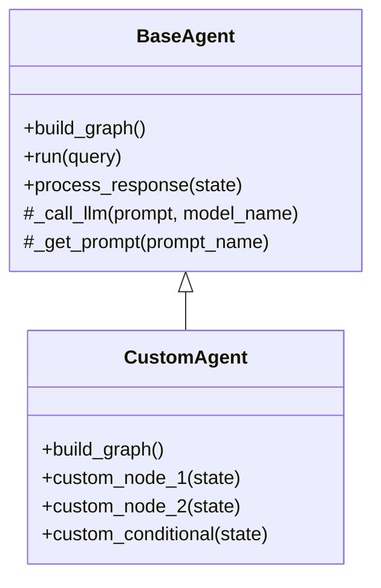

# Advanced Customization Guide

This guide explains how to customize and extend Agent Patterns to create specialized agents, memory systems, and tool providers.

## Creating Custom Agent Patterns

You can create custom agent patterns by extending the `BaseAgent` class and implementing your own flow logic.

### Extension Points for Custom Patterns



### Step-by-Step Implementation

1. Create a new file in your project for your custom agent

2. Import the necessary components:

```python
from agent_patterns.core.base_agent import BaseAgent
from langchain.graphs import Graph
import os
```

3. Define your custom agent class:

```python
class CustomAgent(BaseAgent):
    """Custom agent implementing a specialized workflow."""
    
    def __init__(
        self,
        llm_configs=None,
        memory=None,
        memory_config=None,
        tool_provider=None,
        custom_prompts_directory=None,
        custom_param=None  # Add any custom parameters your agent needs
    ):
        """Initialize the custom agent."""
        super().__init__(
            llm_configs=llm_configs,
            memory=memory,
            memory_config=memory_config,
            tool_provider=tool_provider,
            custom_prompts_directory=custom_prompts_directory
        )
        self.custom_param = custom_param
        
    def build_graph(self):
        """Build the LangGraph workflow."""
        # Create a new graph
        builder = Graph()
        
        # Define the nodes (steps in your agent's workflow)
        builder.add_node("start", self.start_node)
        builder.add_node("process", self.process_node)
        builder.add_node("evaluate", self.evaluate_node)
        builder.add_node("final", self.final_node)
        
        # Define the edges (transitions between steps)
        builder.add_edge("start", "process")
        builder.add_conditional_edges(
            "process",
            self.should_evaluate,
            {
                True: "evaluate",
                False: "final"
            }
        )
        builder.add_edge("evaluate", "process")
        
        # Set the entry point
        builder.set_entry_point("start")
        
        # Build and return the graph
        return builder.compile()
    
    def start_node(self, state):
        """Initialize the workflow state."""
        # Get the user query
        query = state["query"]
        
        # Initialize response
        response = {"thoughts": [], "actions": [], "final_answer": ""}
        
        # Add memory context if available
        if self.memory:
            response["memory_context"] = self.retrieve_from_memory(query)
        
        # Update state
        state["response"] = response
        state["iterations"] = 0
        
        return state
    
    def process_node(self, state):
        """Process the query and generate a response."""
        # Increment iterations
        state["iterations"] += 1
        
        # Get the prompt for this step
        prompt = self._get_prompt("process")
        
        # Format the prompt with state information
        formatted_prompt = prompt.format(
            query=state["query"],
            response=state["response"],
            custom_param=self.custom_param
        )
        
        # Call the LLM
        llm_response = self._call_llm(formatted_prompt, "default")
        
        # Parse the response
        parsed_response = self._parse_llm_response(llm_response)
        
        # Update the state
        state["response"]["thoughts"].append(parsed_response["thought"])
        state["response"]["actions"].append(parsed_response["action"])
        
        return state
    
    def evaluate_node(self, state):
        """Evaluate the current response."""
        # Get the prompt for evaluation
        prompt = self._get_prompt("evaluate")
        
        # Format the prompt
        formatted_prompt = prompt.format(
            query=state["query"],
            response=state["response"]
        )
        
        # Call the LLM
        llm_response = self._call_llm(formatted_prompt, "default")
        
        # Parse the response
        evaluation = self._parse_evaluation(llm_response)
        
        # Update state
        state["response"]["evaluations"] = evaluation
        
        return state
    
    def final_node(self, state):
        """Finalize the response."""
        # Get the prompt for final answer
        prompt = self._get_prompt("final")
        
        # Format the prompt
        formatted_prompt = prompt.format(
            query=state["query"],
            response=state["response"]
        )
        
        # Call the LLM
        final_answer = self._call_llm(formatted_prompt, "default")
        
        # Update state
        state["response"]["final_answer"] = final_answer
        
        # Save to memory if available
        if self.memory:
            self.save_to_memory(state["query"], state["response"])
        
        return state
    
    def should_evaluate(self, state):
        """Conditional function to determine if evaluation is needed."""
        return state["iterations"] < 3  # Example: limit to 3 iterations
    
    def _parse_llm_response(self, llm_response):
        """Parse the LLM response into structured format."""
        # Implement parsing logic for your specific prompt format
        # Example:
        return {
            "thought": "Extracted thought...",
            "action": "Extracted action..."
        }
    
    def _parse_evaluation(self, llm_response):
        """Parse the evaluation response."""
        # Implement evaluation parsing logic
        return {"score": 0.85, "feedback": "Extracted feedback..."}
```

4. Create Custom Prompts

Create a directory for your custom agent's prompts:

```
your_project/
└── prompts/
    └── CustomAgent/
        ├── process.txt
        ├── evaluate.txt
        └── final.txt
```

Example `process.txt`:
```
You are a helpful assistant.

User Query: {query}

Current Response:
{response}

Additional Context:
{custom_param}

Please think about how to respond to the user's query.
First, provide your thought process.
Then, decide on an action to take.

Format your response as follows:
Thought: [Your reasoning process]
Action: [The action you will take]
```

5. Using Your Custom Agent

```python
from your_agent_file import CustomAgent

# Create your custom agent
agent = CustomAgent(
    llm_configs={"default": {"provider": "openai", "model_name": "gpt-4o"}},
    custom_prompts_directory="./prompts",
    custom_param="Additional configuration information"
)

# Run the agent
result = agent.run("What can you help me with?")
print(result)
```

## Building Custom Memory Implementations

You can extend the memory system by implementing custom memory types or persistence layers.

### Creating a Custom Memory Type

1. Import the base classes:

```python
from agent_patterns.core.memory.base import BaseMemory
from agent_patterns.core.memory.persistence import BasePersistence
```

2. Implement your custom memory class:

```python
class PrioritizedMemory(BaseMemory):
    """A memory implementation that prioritizes memories by importance."""
    
    def __init__(self, persistence, namespace="prioritized", priority_threshold=0.7):
        """Initialize prioritized memory."""
        super().__init__(persistence, namespace)
        self.priority_threshold = priority_threshold
    
    async def save(self, data):
        """Save memory with priority information."""
        # Add priority field if not present
        if "priority" not in data:
            data["priority"] = 0.5  # Default priority
        
        # Add timestamp if not present
        if "timestamp" not in data:
            data["timestamp"] = self._get_timestamp()
        
        # Save to persistence layer
        return await self.persistence.save(self.namespace, data)
    
    async def retrieve(self, query, limit=10):
        """Retrieve memories based on relevance and priority."""
        # Get all memories from persistence
        all_memories = await self.persistence.retrieve(self.namespace, query, limit=100)
        
        # Filter by priority threshold
        priority_memories = [m for m in all_memories if m.get("priority", 0) >= self.priority_threshold]
        
        # Sort by relevance and priority
        sorted_memories = sorted(
            priority_memories,
            key=lambda x: (x.get("relevance", 0) * x.get("priority", 0)),
            reverse=True
        )
        
        # Return top results
        return sorted_memories[:limit]
    
    async def update(self, memory_id, updates):
        """Update a memory including its priority."""
        return await self.persistence.update(self.namespace, memory_id, updates)
    
    async def delete(self, memory_id):
        """Delete a memory."""
        return await self.persistence.delete(self.namespace, memory_id)
    
    def _get_timestamp(self):
        """Get current timestamp."""
        import datetime
        return datetime.datetime.now().isoformat()
```

3. Using Your Custom Memory:

```python
from agent_patterns.patterns.re_act_agent import ReActAgent
from agent_patterns.core.memory.persistence import InMemoryPersistence
from your_memory_file import PrioritizedMemory
import asyncio

# Set up persistence and memory
persistence = InMemoryPersistence()
asyncio.run(persistence.initialize())
prioritized_memory = PrioritizedMemory(persistence, priority_threshold=0.6)

# Use in CompositeMemory
from agent_patterns.core.memory import CompositeMemory
memory = CompositeMemory({"prioritized": prioritized_memory})

# Create agent with custom memory
agent = ReActAgent(
    llm_configs={"default": {"provider": "openai", "model_name": "gpt-4o"}},
    memory=memory,
    memory_config={"prioritized": True}
)
```

### Creating a Custom Persistence Layer

1. Import the base class:

```python
from agent_patterns.core.memory.persistence import BasePersistence
```

2. Implement your custom persistence class:

```python
class SQLitePersistence(BasePersistence):
    """Persistence layer using SQLite database."""
    
    def __init__(self, db_path="memory.db"):
        """Initialize SQLite persistence."""
        self.db_path = db_path
        self.connection = None
        
    async def initialize(self):
        """Set up the database connection and tables."""
        import sqlite3
        import aiosqlite
        
        # Create connection
        self.connection = await aiosqlite.connect(self.db_path)
        
        # Create tables if they don't exist
        await self.connection.execute("""
            CREATE TABLE IF NOT EXISTS memories (
                id TEXT PRIMARY KEY,
                namespace TEXT,
                data TEXT,
                embedding TEXT,
                created_at TEXT
            )
        """)
        await self.connection.commit()
    
    async def save(self, namespace, data):
        """Save data to SQLite."""
        import json
        import uuid
        import datetime
        
        # Generate ID
        memory_id = str(uuid.uuid4())
        
        # Prepare data
        serialized_data = json.dumps(data)
        created_at = datetime.datetime.now().isoformat()
        
        # Insert into database
        await self.connection.execute(
            "INSERT INTO memories (id, namespace, data, created_at) VALUES (?, ?, ?, ?)",
            (memory_id, namespace, serialized_data, created_at)
        )
        await self.connection.commit()
        
        return {"id": memory_id, "namespace": namespace}
    
    async def retrieve(self, namespace, query, limit=10):
        """Retrieve data from SQLite."""
        import json
        
        # Query database
        cursor = await self.connection.execute(
            "SELECT id, data FROM memories WHERE namespace = ? ORDER BY created_at DESC LIMIT ?",
            (namespace, limit)
        )
        rows = await cursor.fetchall()
        
        # Parse results
        results = []
        for row in rows:
            memory_id, serialized_data = row
            data = json.loads(serialized_data)
            data["id"] = memory_id
            results.append(data)
        
        return results
    
    async def update(self, namespace, memory_id, updates):
        """Update a memory in SQLite."""
        import json
        
        # Get current data
        cursor = await self.connection.execute(
            "SELECT data FROM memories WHERE id = ? AND namespace = ?",
            (memory_id, namespace)
        )
        row = await cursor.fetchone()
        
        if not row:
            return None
        
        # Update data
        data = json.loads(row[0])
        data.update(updates)
        serialized_data = json.dumps(data)
        
        # Save back to database
        await self.connection.execute(
            "UPDATE memories SET data = ? WHERE id = ? AND namespace = ?",
            (serialized_data, memory_id, namespace)
        )
        await self.connection.commit()
        
        # Return updated data
        data["id"] = memory_id
        return data
    
    async def delete(self, namespace, memory_id):
        """Delete a memory from SQLite."""
        await self.connection.execute(
            "DELETE FROM memories WHERE id = ? AND namespace = ?",
            (memory_id, namespace)
        )
        await self.connection.commit()
        return {"id": memory_id, "deleted": True}
    
    async def close(self):
        """Close the database connection."""
        if self.connection:
            await self.connection.close()
```

3. Using Your Custom Persistence:

```python
from agent_patterns.patterns.re_act_agent import ReActAgent
from agent_patterns.core.memory import CompositeMemory, SemanticMemory
from your_persistence_file import SQLitePersistence
import asyncio

# Set up persistence
sqlite_persistence = SQLitePersistence(db_path="./agent_memory.db")
asyncio.run(sqlite_persistence.initialize())

# Create memory with custom persistence
semantic_memory = SemanticMemory(sqlite_persistence, namespace="agent_knowledge")
memory = CompositeMemory({"semantic": semantic_memory})

# Create agent with custom persistence
agent = ReActAgent(
    llm_configs={"default": {"provider": "openai", "model_name": "gpt-4o"}},
    memory=memory,
    memory_config={"semantic": True}
)
```

## Developing Specialized Tool Providers

You can create custom tool providers to extend the agent's capabilities.

### Creating a Custom Tool Provider

1. Import the base class:

```python
from agent_patterns.core.tools.base import BaseToolProvider, Tool
```

2. Implement your custom tool provider:

```python
class CustomAPIToolProvider(BaseToolProvider):
    """Tool provider for accessing custom API endpoints."""
    
    def __init__(self, api_base_url, api_key=None):
        """Initialize the custom API tool provider."""
        self.api_base_url = api_base_url
        self.api_key = api_key
        super().__init__()
    
    def get_tools(self):
        """Return a list of available tools."""
        return [
            Tool(
                name="search_knowledge_base",
                description="Search the knowledge base for information",
                function=self.search_knowledge_base,
                parameters={
                    "query": {
                        "type": "string",
                        "description": "The search query"
                    }
                }
            ),
            Tool(
                name="create_ticket",
                description="Create a support ticket",
                function=self.create_ticket,
                parameters={
                    "title": {
                        "type": "string",
                        "description": "Ticket title"
                    },
                    "description": {
                        "type": "string",
                        "description": "Ticket description"
                    },
                    "priority": {
                        "type": "string",
                        "enum": ["low", "medium", "high"],
                        "description": "Ticket priority"
                    }
                }
            )
        ]
    
    async def search_knowledge_base(self, query):
        """Search the knowledge base API."""
        import aiohttp
        
        async with aiohttp.ClientSession() as session:
            headers = {}
            if self.api_key:
                headers["Authorization"] = f"Bearer {self.api_key}"
            
            async with session.get(
                f"{self.api_base_url}/search",
                params={"q": query},
                headers=headers
            ) as response:
                if response.status == 200:
                    data = await response.json()
                    return {"results": data.get("results", [])}
                else:
                    return {
                        "error": f"API Error: {response.status}",
                        "message": await response.text()
                    }
    
    async def create_ticket(self, title, description, priority="medium"):
        """Create a support ticket through the API."""
        import aiohttp
        
        async with aiohttp.ClientSession() as session:
            headers = {}
            if self.api_key:
                headers["Authorization"] = f"Bearer {self.api_key}"
                headers["Content-Type"] = "application/json"
            
            payload = {
                "title": title,
                "description": description,
                "priority": priority
            }
            
            async with session.post(
                f"{self.api_base_url}/tickets",
                json=payload,
                headers=headers
            ) as response:
                if response.status in (200, 201):
                    data = await response.json()
                    return {
                        "ticket_id": data.get("id"),
                        "status": data.get("status"),
                        "message": "Ticket created successfully"
                    }
                else:
                    return {
                        "error": f"API Error: {response.status}",
                        "message": await response.text()
                    }
```

3. Using Your Custom Tool Provider:

```python
from agent_patterns.patterns.re_act_agent import ReActAgent
from your_tool_provider_file import CustomAPIToolProvider

# Create your custom tool provider
tool_provider = CustomAPIToolProvider(
    api_base_url="https://your-api.example.com/v1",
    api_key="your-api-key"
)

# Create agent with custom tools
agent = ReActAgent(
    llm_configs={"default": {"provider": "openai", "model_name": "gpt-4o"}},
    tool_provider=tool_provider
)

# Run the agent with a query that might use the tools
result = agent.run("I need to find information about our product pricing, and then create a ticket for the sales team.")
print(result)
```

## Extending BaseAgent Class

For more advanced customization, you can extend the `BaseAgent` class and override its core methods.

### Extension Points in BaseAgent

The key methods you can override:

1. `build_graph()`: Define the LangGraph workflow structure
2. `run(query)`: Customize the entry point for agent execution
3. `_call_llm(prompt, model_name)`: Modify how LLMs are called
4. `_get_prompt(prompt_name)`: Change prompt loading and processing
5. `process_response(state)`: Customize final response processing

### Example: Custom LLM Integration

```python
from agent_patterns.core.base_agent import BaseAgent
from agent_patterns.patterns.re_act_agent import ReActAgent
import aiohttp
import json

class CustomLLMAgent(ReActAgent):
    """ReAct agent with custom LLM integration."""
    
    def __init__(
        self,
        custom_llm_endpoint,
        custom_llm_auth_key,
        **kwargs
    ):
        """Initialize with custom LLM details."""
        super().__init__(**kwargs)
        self.custom_llm_endpoint = custom_llm_endpoint
        self.custom_llm_auth_key = custom_llm_auth_key
    
    async def _call_llm(self, prompt, model_config_key="default"):
        """Override to use custom LLM API."""
        # If using the default model config, use custom LLM
        if model_config_key == "default":
            async with aiohttp.ClientSession() as session:
                headers = {
                    "Content-Type": "application/json",
                    "Authorization": f"Bearer {self.custom_llm_auth_key}"
                }
                
                payload = {
                    "prompt": prompt,
                    "max_tokens": 1000,
                    "temperature": 0.7
                }
                
                async with session.post(
                    self.custom_llm_endpoint,
                    headers=headers,
                    json=payload
                ) as response:
                    if response.status == 200:
                        data = await response.json()
                        return data.get("completion", "")
                    else:
                        error_text = await response.text()
                        raise Exception(f"LLM API Error: {response.status}, {error_text}")
        else:
            # For other model configs, use the parent implementation
            return await super()._call_llm(prompt, model_config_key)
```

### Example: Custom UX Integration

```python
from agent_patterns.patterns.plan_and_solve_agent import PlanAndSolveAgent
import asyncio

class StreamingAgent(PlanAndSolveAgent):
    """Plan and Solve agent with streaming response capabilities."""
    
    def __init__(self, callback_fn=None, **kwargs):
        """Initialize with streaming callback."""
        super().__init__(**kwargs)
        self.callback_fn = callback_fn
    
    def run(self, query):
        """Override to provide streaming capability."""
        # Create an event loop if one doesn't exist
        try:
            loop = asyncio.get_event_loop()
        except RuntimeError:
            loop = asyncio.new_event_loop()
            asyncio.set_event_loop(loop)
        
        # Run the async streaming method
        return loop.run_until_complete(self.stream_run(query))
    
    async def stream_run(self, query):
        """Run the agent with streaming updates."""
        # Initialize state
        state = {"query": query}
        
        # Stream planning step
        state = await self._stream_step(
            state, 
            "Developing plan...", 
            self.get_plan_node
        )
        
        # Stream execution step
        state = await self._stream_step(
            state,
            "Executing plan...",
            self.execute_plan_node
        )
        
        # Stream final response
        state = await self._stream_step(
            state,
            "Finalizing response...",
            self.finalize_response_node
        )
        
        # Return final response
        return state["response"]["final_answer"]
    
    async def _stream_step(self, state, message, node_function):
        """Execute a step with streaming updates."""
        # Send initial message
        if self.callback_fn:
            self.callback_fn(message)
        
        # Execute node function
        updated_state = node_function(state)
        
        # Send update if response changed
        if self.callback_fn and "response" in updated_state:
            if "final_answer" in updated_state["response"]:
                self.callback_fn(updated_state["response"]["final_answer"])
        
        return updated_state
```

Usage:

```python
def stream_callback(message):
    """Process streaming updates."""
    print(f"Update: {message}")

# Create streaming agent
agent = StreamingAgent(
    llm_configs={"default": {"provider": "openai", "model_name": "gpt-4o"}},
    callback_fn=stream_callback
)

# Run the agent
result = agent.run("Explain quantum computing in simple terms.")
```