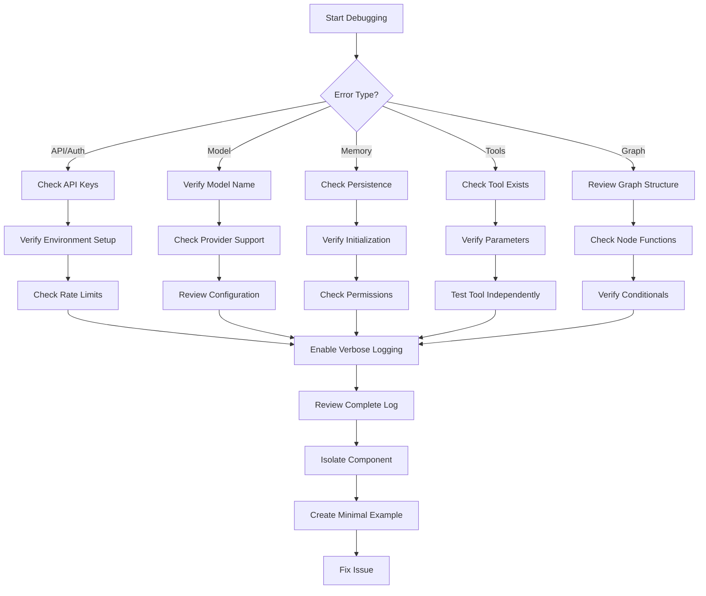

# Troubleshooting Guide

This guide provides solutions for common issues when working with Agent Patterns.

## Common Error Messages and Solutions

### API Authentication Errors

| Error Message | Possible Cause | Solution |
|---------------|----------------|----------|
| `"Authentication error: Invalid API key"` | Invalid or expired API key | Check your environment variables and ensure your API keys are up-to-date. |
| `"API key not found"` | Missing API key in environment | Make sure you've set the API key in your `.env` file and called `load_dotenv()`. |
| `"Quota exceeded"` | You've exceeded your API provider's limits | Check your usage dashboard and consider upgrading your plan. |

### Model Configuration Errors

| Error Message | Possible Cause | Solution |
|---------------|----------------|----------|
| `"Model '[model_name]' not found"` | Incorrect model name or unsupported model | Verify the model name and check if it's supported by your provider. |
| `"Model configuration for '[config_key]' not found"` | Missing or misconfigured LLM settings | Ensure you've provided the correct LLM configuration in the `llm_configs` dictionary. |
| `"Invalid model provider '[provider]'"` | Unsupported model provider | Check that you're using a supported provider (openai, anthropic, etc.). |

### Memory Errors

| Error Message | Possible Cause | Solution |
|---------------|----------------|----------|
| `"Memory component '[name]' not found"` | Referencing a non-existing memory component | Check your memory configuration and ensure the component exists in your CompositeMemory. |
| `"Failed to save to memory"` | Issues with the persistence layer | Check persistence configuration and file permissions. |
| `"Memory persistence layer not initialized"` | Memory persistence not initialized | Make sure you've run `await persistence.initialize()` before using memory components. |

### Tool Provider Errors

| Error Message | Possible Cause | Solution |
|---------------|----------------|----------|
| `"Tool '[tool_name]' not found"` | Referencing a non-existing tool | Verify tool names and check tool provider configuration. |
| `"Failed to execute tool '[tool_name]'"` | Tool execution error | Check the specific tool's requirements and network connectivity. |
| `"Missing required parameter '[param]' for tool '[tool_name]'"` | Missing required parameter | Ensure all required parameters are provided to the tool. |

### MCP Integration Errors

| Error Message | Possible Cause | Solution |
|---------------|----------------|----------|
| `"Failed to connect to MCP server"` | Server connection issues | Check network connectivity and server configuration. |
| `"MCP server process terminated unexpectedly"` | Server process crashed | Check server logs for errors and ensure dependencies are installed. |
| `"Tool execution timed out"` | Slow tool execution | Increase the timeout setting or optimize the tool implementation. |

## Debugging Strategies

### Flowchart for Diagnostic Process



### Enabling Debug Mode

To enable detailed logging for debugging:

```python
import logging
import sys

# Configure logging
logging.basicConfig(
    level=logging.DEBUG,
    format='%(asctime)s - %(name)s - %(levelname)s - %(message)s',
    handlers=[logging.StreamHandler(sys.stdout)]
)

# Get logger for agent patterns
logger = logging.getLogger('agent_patterns')
logger.setLevel(logging.DEBUG)
```

### Component Isolation

When debugging complex issues:

1. Isolate individual components (agent, memory, tools)
2. Test each component independently
3. Combine components incrementally to identify the source of the issue

Example component isolation code:

```python
# Isolating memory component
from agent_patterns.core.memory import SemanticMemory
from agent_patterns.core.memory.persistence import InMemoryPersistence
import asyncio

# Set up persistence
persistence = InMemoryPersistence()
asyncio.run(persistence.initialize())

# Create memory component
memory = SemanticMemory(persistence, namespace="test")

# Test saving and retrieving
async def test_memory():
    # Save test data
    save_result = await memory.save({
        "entity": "test",
        "attribute": "value",
        "value": "testing"
    })
    print(f"Save result: {save_result}")
    
    # Retrieve data
    results = await memory.retrieve("test value")
    print(f"Retrieved: {results}")

# Run test
asyncio.run(test_memory())
```

## Performance Optimization Tips

### Agent Performance

1. **Model Selection**: Use the appropriate model size for your task complexity
   ```python
   # For simple tasks, use a faster model
   llm_configs = {"default": {"provider": "openai", "model_name": "gpt-4o-mini"}}
   
   # For complex reasoning, use a more capable model
   llm_configs = {"default": {"provider": "anthropic", "model_name": "claude-3-opus"}}
   ```

2. **Prompt Optimization**: Simplify prompts for faster processing
   ```python
   # Instead of verbose instructions:
   prompt = """
   You are a helpful assistant. You need to help the user with their question.
   Think step by step and provide a detailed answer with all the relevant information.
   User question: {question}
   """
   
   # Use concise prompts:
   prompt = """
   Answer this question concisely and accurately: {question}
   """
   ```

3. **Lazy Loading**: Load resources only when needed
   ```python
   class OptimizedAgent(ReActAgent):
       def __init__(self, **kwargs):
           super().__init__(**kwargs)
           self._tool_provider = None  # Initialize lazily
       
       @property
       def tool_provider(self):
           if self._tool_provider is None and hasattr(self, '_tool_provider_config'):
               # Create tool provider only when needed
               self._tool_provider = self._create_tool_provider(self._tool_provider_config)
           return self._tool_provider
   ```

### Memory Optimization

1. **Batch Operations**: Use batch operations for memory
   ```python
   # Instead of multiple individual saves:
   async def save_multiple_memories(memory, items):
       batch = []
       for item in items:
           batch.append(memory.save(item))
       return await asyncio.gather(*batch)
   ```

2. **Memory Pruning**: Implement memory pruning to remove old/irrelevant memories
   ```python
   async def prune_old_memories(memory, days=30):
       import datetime
       
       # Calculate cutoff date
       cutoff = datetime.datetime.now() - datetime.timedelta(days=days)
       cutoff_str = cutoff.isoformat()
       
       # Get all memories
       memories = await memory.retrieve("", limit=1000)
       
       # Delete old memories
       for mem in memories:
           if mem.get("timestamp", "") < cutoff_str:
               await memory.delete(mem["id"])
   ```

3. **Optimized Retrieval**: Use more specific queries for memory retrieval
   ```python
   # Instead of broad queries:
   memories = await memory.retrieve("information")
   
   # Use specific queries:
   memories = await memory.retrieve("customer contact information")
   ```

### Tool Optimization

1. **Concurrent Tool Execution**: Run tools concurrently when possible
   ```python
   async def run_tools_concurrently(tools, params_list):
       tasks = []
       for tool, params in zip(tools, params_list):
           tasks.append(tool.function(**params))
       return await asyncio.gather(*tasks)
   ```

2. **Caching Tool Results**: Implement caching for expensive tool operations
   ```python
   class CachedToolProvider(BaseToolProvider):
       def __init__(self):
           super().__init__()
           self.cache = {}
       
       async def execute_tool(self, tool_name, **params):
           # Create cache key from tool name and params
           import json
           cache_key = f"{tool_name}:{json.dumps(params, sort_keys=True)}"
           
           # Check cache
           if cache_key in self.cache:
               return self.cache[cache_key]
           
           # Execute tool
           result = await super().execute_tool(tool_name, **params)
           
           # Cache result
           self.cache[cache_key] = result
           return result
   ```

## Memory Management Best Practices

### Memory Persistence Strategy

Choose the right persistence strategy based on your use case:

```python
# For testing and development:
from agent_patterns.core.memory.persistence import InMemoryPersistence
persistence = InMemoryPersistence()

# For production with file-based storage:
from agent_patterns.core.memory.persistence import FilePersistence
persistence = FilePersistence(directory="./memory_store")

# For scalable applications with vector database:
from agent_patterns.core.memory.persistence import PineconeVectorDBPersistence
persistence = PineconeVectorDBPersistence(
    api_key="your-pinecone-api-key",
    environment="us-west1-gcp",
    index_name="agent-memory"
)
```

### Memory Namespacing

Use proper namespacing to organize memories:

```python
# Create namespaced memories for different contexts
user_memory = SemanticMemory(persistence, namespace="user_data")
knowledge_memory = SemanticMemory(persistence, namespace="knowledge_base")
conversation_memory = EpisodicMemory(persistence, namespace="conversations")

# Combine in CompositeMemory
memory = CompositeMemory({
    "user": user_memory,
    "knowledge": knowledge_memory,
    "conversation": conversation_memory
})
```

### Regular Maintenance

Implement regular maintenance tasks:

```python
async def maintain_memory_system(memory):
    # Archive old conversations
    await archive_old_memories(memory, "conversation", days=90)
    
    # Remove duplicates
    await remove_duplicate_memories(memory, "knowledge")
    
    # Validate and repair any corrupted entries
    await validate_memory_entries(memory)
```

## Debug Output Interpretation

### Example Debug Output for ReAct Agent

```
DEBUG:agent_patterns.core.base_agent:Agent initialization started
DEBUG:agent_patterns.core.base_agent:Initializing model provider: openai, model: gpt-4o
DEBUG:agent_patterns.core.base_agent:Loading prompts from directory: /path/to/prompts/ReActAgent
DEBUG:agent_patterns.core.base_agent:Building graph...
DEBUG:agent_patterns.patterns.re_act_agent:Adding nodes: start_node, thinking_node, action_node, observation_node, final_node
DEBUG:agent_patterns.patterns.re_act_agent:Graph compiled successfully
DEBUG:agent_patterns.core.base_agent:Agent initialized successfully

DEBUG:agent_patterns.core.base_agent:Running agent with query: How tall is the Eiffel Tower?
DEBUG:agent_patterns.core.base_agent:Executing node: start_node
DEBUG:agent_patterns.patterns.re_act_agent:Start node executed, initialized state
DEBUG:agent_patterns.core.base_agent:Executing node: thinking_node
DEBUG:agent_patterns.core.base_agent:Calling LLM with prompt (first 50 chars): You are a helpful assistant that can reason and use tool...
DEBUG:agent_patterns.core.base_agent:LLM response received (length: 521 chars)
DEBUG:agent_patterns.patterns.re_act_agent:Parsed thinking: I need to find out the height of the Eiffel Tower...
DEBUG:agent_patterns.core.base_agent:Executing node: action_node
DEBUG:agent_patterns.patterns.re_act_agent:Action detected: search
DEBUG:agent_patterns.core.tools:Executing tool: search with params: {"query": "height of Eiffel Tower"}
DEBUG:agent_patterns.core.tools:Tool response received (length: 245 chars)
DEBUG:agent_patterns.core.base_agent:Executing node: observation_node
DEBUG:agent_patterns.patterns.re_act_agent:Observation added to state
DEBUG:agent_patterns.core.base_agent:Executing conditional: should_continue
DEBUG:agent_patterns.patterns.re_act_agent:Condition result: False, transitioning to final_node
DEBUG:agent_patterns.core.base_agent:Executing node: final_node
DEBUG:agent_patterns.core.base_agent:Calling LLM with prompt (first 50 chars): You are a helpful assistant. Provide a final answer...
DEBUG:agent_patterns.core.base_agent:LLM response received (length: 128 chars)
DEBUG:agent_patterns.core.base_agent:Processing final response
DEBUG:agent_patterns.core.base_agent:Agent run completed successfully
```

### Interpreting the Debug Output

1. **Initialization Phase**:
   - Check the model provider and model name are correct
   - Verify prompt directory path is correct
   - Confirm that the graph builds successfully with all expected nodes

2. **Execution Phase**:
   - Track the flow through nodes (start_node → thinking_node → action_node, etc.)
   - Examine LLM prompt and response lengths
   - Monitor tool executions and parameters
   - Check conditional transitions (should_continue = False → final_node)

3. **Common Warning Signs**:
   - Missing or truncated LLM responses
   - Tools executing with incorrect parameters
   - Unexpected conditional results
   - Graph nodes executing in unexpected order

## Advanced Debugging Techniques

### Runtime State Inspection

Add a debug node to your graph to inspect state:

```python
def build_graph(self):
    builder = Graph()
    # Add standard nodes
    builder.add_node("start", self.start_node)
    builder.add_node("process", self.process_node)
    # Add debug node
    builder.add_node("debug", self.debug_node)
    # Add edges
    builder.add_edge("start", "debug")
    builder.add_edge("debug", "process")
    # Rest of graph...
    return builder.compile()

def debug_node(self, state):
    """Debug node to inspect state."""
    import json
    print(f"=== DEBUG STATE ===")
    print(json.dumps(state, indent=2))
    print(f"===================")
    return state
```

### Custom Tracers

Implement a custom tracer for detailed execution tracking:

```python
class AgentTracer:
    def __init__(self, log_file="agent_trace.log"):
        self.log_file = log_file
        with open(self.log_file, "w") as f:
            f.write("=== AGENT EXECUTION TRACE ===\n")
    
    def trace(self, event, data=None):
        import json
        import time
        
        timestamp = time.strftime("%Y-%m-%d %H:%M:%S")
        with open(self.log_file, "a") as f:
            f.write(f"[{timestamp}] {event}\n")
            if data:
                f.write(f"{json.dumps(data, indent=2)}\n")
            f.write("-" * 40 + "\n")

# Usage
tracer = AgentTracer()

class TracedAgent(ReActAgent):
    def __init__(self, tracer, **kwargs):
        super().__init__(**kwargs)
        self.tracer = tracer
    
    def _call_llm(self, prompt, model_config_key="default"):
        self.tracer.trace("LLM_CALL", {
            "model": model_config_key,
            "prompt_length": len(prompt)
        })
        result = super()._call_llm(prompt, model_config_key)
        self.tracer.trace("LLM_RESPONSE", {
            "response_length": len(result)
        })
        return result
```