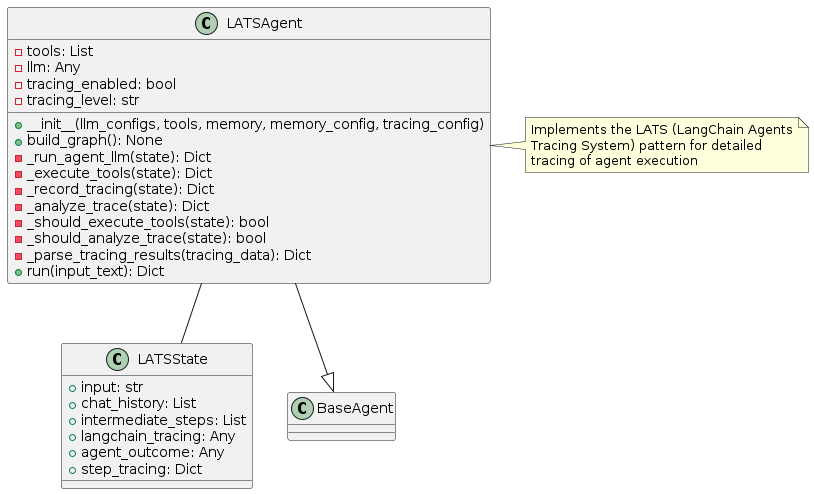
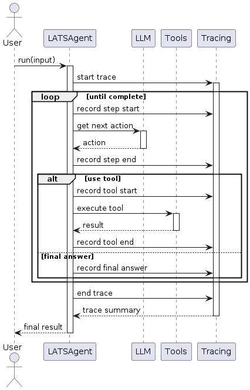
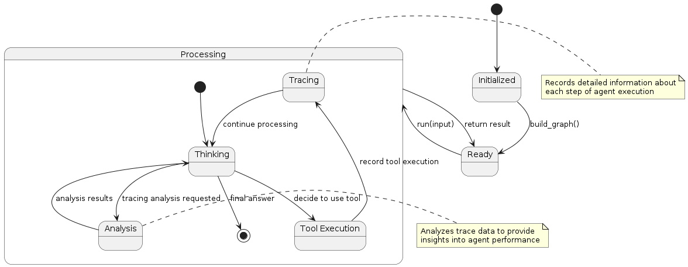

# LATS (LangChain Agents Tracing System) Pattern

## Overview
The LATS pattern integrates comprehensive tracing and monitoring capabilities into the agent execution flow. This pattern focuses on:

1. **Detailed Tracing**: Recording every step of agent execution with rich metadata
2. **Performance Monitoring**: Tracking metrics like response time, token usage, and success rates
3. **Debugging Support**: Providing detailed information for troubleshooting
4. **Analysis Tools**: Offering insights into agent behavior and performance

The key innovation of this pattern is its focus on observability, making agent behavior more transparent and analyzable.

## Diagrams

### Class Structure


The LATS pattern is implemented through:

- **LATSState**: Extends the basic agent state with tracing information
- **LATSAgent**: Implements the agent logic with integrated tracing capabilities
- **BaseAgent**: The abstract base class from which the LATS agent inherits

### Execution Flow


The execution flow follows:
1. User provides input to the LATSAgent
2. The agent starts a trace for the current execution
3. Each step of reasoning or tool execution is recorded:
   - The agent records the start of each step
   - The step is executed
   - The agent records the end of the step with results
4. Analysis can be performed on trace data during or after execution
5. Final result is returned to the user along with trace summary

### State Transitions


The LATS pattern transitions through these states:
- **Initialized**: Agent is created but not yet ready
- **Ready**: Agent is ready to process input
- **Processing**: Agent is actively working on the task
  - **Thinking**: Agent is reasoning about what to do next
  - **Tool Execution**: Agent is using a tool
  - **Tracing**: Agent is recording trace information
  - **Analysis**: Agent is analyzing trace data
- Final state is reached when the agent determines a final answer

## Use Cases
- **Agent Debugging**: For identifying issues in agent reasoning or tool usage
- **Performance Optimization**: When monitoring and improving agent efficiency
- **Compliance Requirements**: For systems that need audit trails of agent activities
- **User Explanation**: To provide transparency into how answers were derived
- **Research Applications**: For studying agent behavior and improving algorithms
- **Multi-Agent Systems**: For coordinating and analyzing interactions between agents

## Implementation Guide

Here's a simple example of using the LATSAgent:

```python
from agent_patterns.patterns import LATSAgent
from agent_patterns.core.tools import ToolRegistry
from agent_patterns.core.memory import CompositeMemory, EpisodicMemory
from langchain.tools import tool

# Define a simple tool
@tool
def search(query: str) -> str:
    """Search for information about a topic."""
    return f"Results for {query}: Some relevant information..."

# Create tool registry
tool_registry = ToolRegistry([search])

# Create memory system
memory = CompositeMemory({
    "episodic": EpisodicMemory(),  # For storing trace histories
})

# Configure the LLMs
llm_configs = {
    "default": {
        "provider": "openai",
        "model": "gpt-4o",
        "temperature": 0.7
    }
}

# Configure tracing
tracing_config = {
    "enabled": True,
    "level": "detailed",  # Options: basic, detailed, comprehensive
    "persist": True,      # Store traces in memory
    "metrics": ["tokens", "latency", "tool_usage"]
}

# Initialize the LATS agent
agent = LATSAgent(
    llm_configs=llm_configs,
    tool_provider=tool_registry,
    memory=memory,
    tracing_config=tracing_config
)

# Run the agent
result = agent.run("What is the capital of France?")
print(result)

# Retrieve and analyze trace
trace = agent.get_last_trace()
print(f"Execution took {trace['duration']} seconds")
print(f"Used {trace['token_count']} tokens")
print(f"Tool usage: {trace['tool_usage']}")
```

## Example References
The examples directory contains implementations of the LATS pattern:
- `examples/lats_basic.py`: Basic implementation with tracing
- `examples/lats_analysis.py`: Advanced implementation with trace analysis

## Best Practices
- Set appropriate tracing levels based on needs (development vs. production)
- Implement trace sampling for high-volume applications
- Create visualizations of trace data for easier analysis
- Establish alerting based on trace metrics (e.g., for slow responses)
- Store traces in a structured format for easier querying
- Implement privacy controls to manage sensitive information in traces
- Use traces to identify opportunities for agent optimization

## Related Patterns
- **ReAct Pattern**: LATS can be applied to enhance any ReAct implementation
- **Reflection Pattern**: Traces provide valuable data for reflection
- **STORM Pattern**: LATS tracing can enhance STORM's self-evaluation capabilities