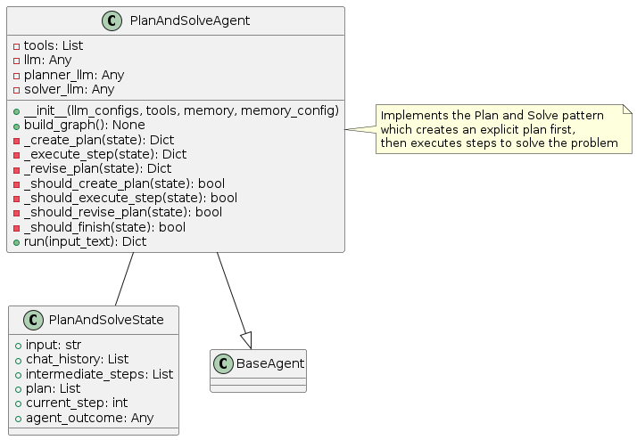
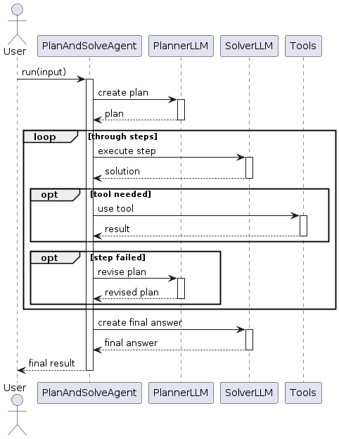
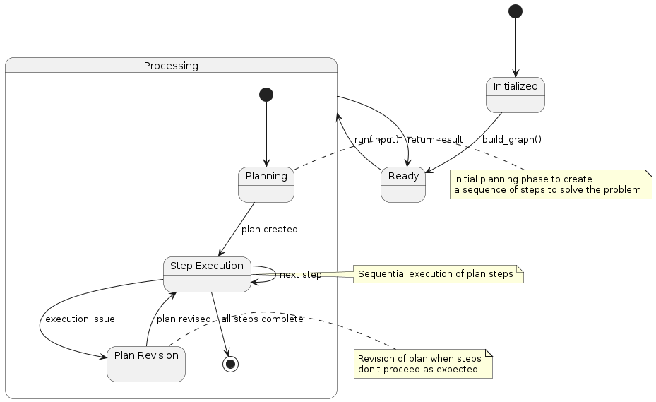

# Plan and Solve Pattern

## Overview
The Plan and Solve pattern implements a two-phase approach to problem-solving. First, a detailed plan is created, and then each step of the plan is systematically executed. This pattern involves:

1. **Planning Phase**: The agent creates a comprehensive plan with sequential steps
2. **Execution Phase**: Each step is executed in order, with the option to revise the plan
3. **Plan Revision**: If execution issues arise, the plan can be updated
4. **Final Solution**: After all steps are executed, a final solution is produced

This pattern excels in scenarios requiring structured approaches to complex problems.

## Diagrams

### Class Structure


The Plan and Solve pattern is implemented through:

- **PlanAndSolveState**: Maintains the plan, current step, and execution state
- **PlanAndSolveAgent**: Implements planning, step execution, and plan revision
- **BaseAgent**: The abstract base class from which the Plan and Solve agent inherits

### Execution Flow


The execution flow follows:
1. User provides input to the PlanAndSolveAgent
2. The Planner component creates a detailed execution plan
3. For each step in the plan:
   - The Solver component executes the step
   - If needed, tools are used to complete the step
   - If step execution fails, the plan may be revised
4. After all steps are complete, a final answer is generated
5. Final result is returned to the user

### State Transitions


The Plan and Solve pattern transitions through these states:
- **Initialized**: Agent is created but not yet ready
- **Ready**: Agent is ready to process input
- **Processing**: Agent is actively working on the task
  - **Planning**: Agent is creating the initial plan
  - **Step Execution**: Agent is executing a step from the plan
  - **Plan Revision**: Agent is revising the plan if needed
- Final state is reached when all steps in the plan are successfully executed

## Use Cases
- **Multi-Step Problems**: For tasks requiring a sequence of distinct steps
- **Research Projects**: When a structured approach to investigation is needed
- **Complex Calculations**: For breaking down complex calculations into manageable steps
- **Data Analysis**: When a systematic approach to data processing is required
- **Tutorial Generation**: For creating step-by-step guides or tutorials
- **Project Management**: For planning and executing projects in an organized way

## Implementation Guide

Here's a simple example of using the PlanAndSolveAgent:

```python
from agent_patterns.patterns import PlanAndSolveAgent
from agent_patterns.core.tools import ToolRegistry
from agent_patterns.core.memory import CompositeMemory, ProceduralMemory
from langchain.tools import tool

# Define tools
@tool
def search(query: str) -> str:
    """Search for information about a topic."""
    return f"Results for {query}: Some relevant information..."

@tool
def calculate(expression: str) -> str:
    """Calculate the result of a mathematical expression."""
    try:
        return f"Result: {eval(expression)}"
    except:
        return "Error in calculation"

# Create tool registry
tool_registry = ToolRegistry([search, calculate])

# Create memory system
memory = CompositeMemory({
    "procedural": ProceduralMemory()  # For storing plans
})

# Configure the LLMs
llm_configs = {
    "default": {
        "provider": "openai",
        "model": "gpt-4o",
        "temperature": 0.7
    },
    "planner": {
        "provider": "openai",
        "model": "gpt-4o",
        "temperature": 0.4  # Lower temperature for more focused planning
    },
    "solver": {
        "provider": "openai",
        "model": "gpt-4o",
        "temperature": 0.6
    }
}

# Initialize the Plan and Solve agent
agent = PlanAndSolveAgent(
    llm_configs=llm_configs,
    tool_provider=tool_registry,
    memory=memory
)

# Run the agent
result = agent.run("Calculate the volume of a cylinder with radius 5cm and height 10cm, then convert to liters.")
print(result)
```

## Example References
The examples directory contains implementations of the Plan and Solve pattern:
- `examples/plan_and_solve_basic.py`: Basic implementation
- `examples/plan_and_solve_complex.py`: Implementation with plan revision capabilities

## Best Practices
- Design planning prompts that encourage detailed, actionable steps
- Include validation checkpoints in plans to verify intermediate results
- Implement robust plan revision mechanisms
- Store successful plans in memory for reuse with similar problems
- Consider using different LLM configurations for planning vs. solving
- Structure the plan format to be both human-readable and machine-processable
- Include resource estimates (time, tokens, API calls) in the planning phase

## Related Patterns
- **LLM Compiler Pattern**: Similar approach with more emphasis on compilation analogy
- **ReAct Pattern**: More integrated approach without clear planning/execution separation
- **ReWOO Pattern**: Similar structured approach but with simulation capabilities