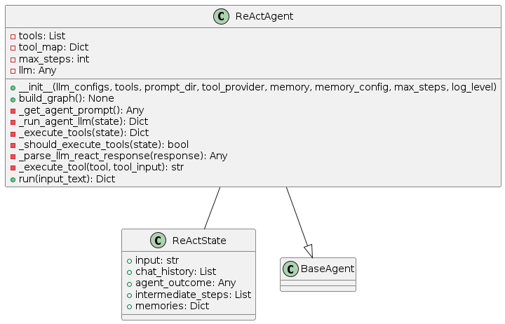
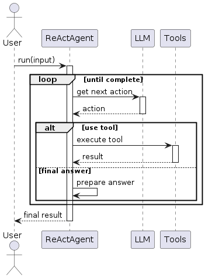

# ReAct Pattern

## Overview
The ReAct (Reason + Act) pattern implements a cycle of reasoning followed by action execution. It's one of the foundational agent patterns that combines an LLM's ability to reason with the capability to execute tools. The agent repeatedly follows a cycle of:

1. **Reasoning**: The LLM analyzes the current state, including the task and any previous observations
2. **Acting**: The agent executes an action (typically a tool) based on its reasoning
3. **Observing**: The agent collects the result of the action
4. **Repeating**: The cycle continues until a final answer is reached

This pattern is implemented using a state graph with two primary nodes: the agent node (for reasoning) and the tool execution node.

## Diagrams

### Class Structure


The ReAct pattern is implemented through:

- **ReActState**: Maintains the current state of execution, including input, chat history, intermediate steps, and agent outcome
- **ReActAgent**: The primary class that implements the pattern, containing methods for running the agent LLM, executing tools, and managing the state transitions
- **BaseAgent**: The abstract base class from which ReActAgent inherits

### Execution Flow


The execution flow follows:
1. User provides input to the ReActAgent
2. Agent examines the input and thinks about what to do
3. Agent decides either to use a tool or provide a final answer
4. If using a tool, the agent executes it and receives the result
5. Agent considers the tool's result in the next thinking step
6. Cycle continues until the agent decides on a final answer
7. Final answer is returned to the user

### State Transitions


The ReAct pattern transitions through these states:
- **Initialized**: Agent is created but not yet ready
- **Ready**: Agent is ready to process input
- **Processing**: Agent is actively working on the task
  - **Thinking**: Agent is reasoning about what to do next
  - **Tool Execution**: Agent is using a tool
- Final state is reached when the agent determines a final answer

## Use Cases
- **Question Answering**: When questions require factual information that might need lookup operations
- **Task Automation**: For multi-step tasks requiring both reasoning and use of tools
- **Information Gathering**: When the agent needs to collect information from multiple sources
- **Decision Making**: For situations requiring both analysis and action
- **Interactive Assistance**: When users need help completing tasks that involve multiple steps

## Implementation Guide

Here's a simple example of using the ReActAgent:

```python
from agent_patterns.patterns import ReActAgent
from agent_patterns.core.tools import ToolRegistry
from langchain.tools import tool

# Define a simple tool
@tool
def search(query: str) -> str:
    """Search for information about a topic."""
    # In a real implementation, this would connect to a search engine
    return f"Results for {query}: Some relevant information..."

# Create tool registry with the search tool
tool_registry = ToolRegistry([search])

# Configure the LLM
llm_configs = {
    "default": {
        "provider": "openai",
        "model": "gpt-4o",
        "temperature": 0.7
    }
}

# Initialize the ReAct agent
agent = ReActAgent(
    llm_configs=llm_configs,
    tool_provider=tool_registry
)

# Run the agent
result = agent.run("What is the capital of France and what's its population?")
print(result)
```

## Example References
The examples directory contains implementations of the ReAct pattern:
- `examples/react_simple.py`: A basic ReAct agent implementation
- `examples/react_with_memory.py`: ReAct agent with memory capabilities

## Best Practices
- Keep tool descriptions clear and specific to help the LLM decide when to use them
- Set an appropriate `max_steps` value to prevent infinite loops
- Use memory when handling complex or multi-turn interactions
- Structure prompts to encourage step-by-step reasoning before actions
- Handle tool execution errors gracefully to allow the agent to recover
- Add logging for better debugging and transparency

## Related Patterns
- **Reflexion Pattern**: Extends ReAct with reflection capabilities
- **Plan and Solve Pattern**: More structured approach with explicit planning before action
- **LLM Compiler Pattern**: Similar execution flow but with a compilation-like approach to tasks