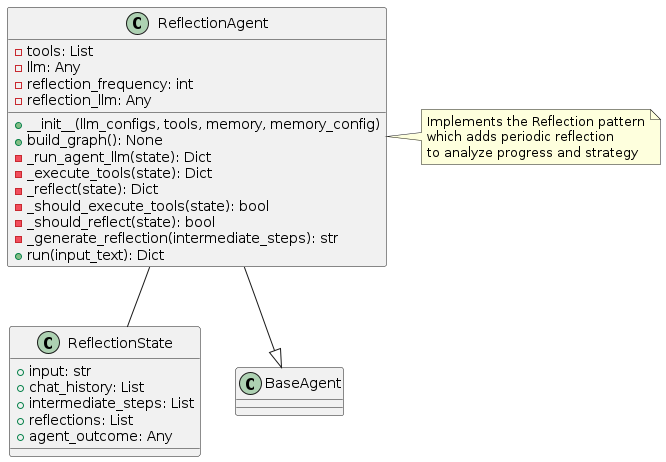
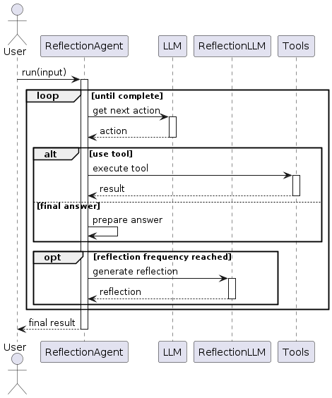
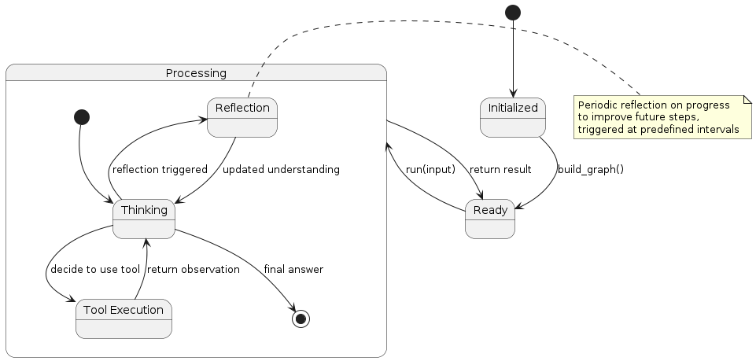

# Reflection Pattern

## Overview
The Reflection pattern introduces periodic reflection phases into the agent's execution flow. Unlike the Reflexion pattern which reflects after actions, this pattern schedules regular reflection at predefined intervals. The pattern involves:

1. **Normal Execution**: Standard reasoning and action execution
2. **Scheduled Reflection**: Periodic pauses to review progress
3. **Strategic Adjustment**: Using reflections to adjust the overall approach
4. **Knowledge Integration**: Incorporating insights into the agent's understanding

This pattern is particularly effective for longer-running tasks where course corrections may be needed.

## Diagrams

### Class Structure


The Reflection pattern is implemented through:

- **ReflectionState**: Extends the basic agent state with reflection information
- **ReflectionAgent**: Implements the agent logic with scheduled reflection capabilities
- **BaseAgent**: The abstract base class from which the Reflection agent inherits

### Execution Flow


The execution flow follows:
1. User provides input to the ReflectionAgent
2. The agent processes the task through standard reasoning and tool execution
3. At predefined intervals (e.g., every X steps), a reflection phase is triggered
4. During reflection, the agent reviews its progress and approach
5. Insights from reflection inform subsequent execution
6. The process continues until a final answer is reached
7. Final result is returned to the user

### State Transitions


The Reflection pattern transitions through these states:
- **Initialized**: Agent is created but not yet ready
- **Ready**: Agent is ready to process input
- **Processing**: Agent is actively working on the task
  - **Thinking**: Agent is reasoning about what to do next
  - **Tool Execution**: Agent is using a tool
  - **Reflection**: Agent is performing scheduled reflection
- Final state is reached when the agent determines a final answer

## Use Cases
- **Long-Running Tasks**: For tasks that require extended execution time
- **Strategic Planning**: When high-level strategy adjustments might be needed
- **Learning During Execution**: For agents that need to adapt their approach as they go
- **Complex Problem Solving**: When the solution approach isn't clear from the start
- **Explorative Research**: For open-ended research tasks where direction may need adjustment

## Implementation Guide

Here's a simple example of using the ReflectionAgent:

```python
from agent_patterns.patterns import ReflectionAgent
from agent_patterns.core.tools import ToolRegistry
from agent_patterns.core.memory import CompositeMemory, SemanticMemory
from langchain.tools import tool

# Define tools
@tool
def search(query: str) -> str:
    """Search for information about a topic."""
    return f"Results for {query}: Some relevant information..."

@tool
def note(content: str) -> str:
    """Make a note of important information."""
    return f"Noted: {content}"

# Create tool registry
tool_registry = ToolRegistry([search, note])

# Create memory system
memory = CompositeMemory({
    "semantic": SemanticMemory(),  # For storing reflections as knowledge
})

# Configure the LLMs
llm_configs = {
    "default": {
        "provider": "openai",
        "model": "gpt-4o",
        "temperature": 0.7
    },
    "reflection": {
        "provider": "openai",
        "model": "gpt-4o",
        "temperature": 0.5  # Lower temperature for more focused reflection
    }
}

# Initialize the Reflection agent
agent = ReflectionAgent(
    llm_configs=llm_configs,
    tool_provider=tool_registry,
    memory=memory,
    reflection_frequency=5  # Reflect every 5 steps
)

# Run the agent
result = agent.run("Research the impact of climate change on agriculture and suggest three adaptation strategies.")
print(result)
```

## Example References
The examples directory contains implementations of the Reflection pattern:
- `examples/reflection_basic.py`: Basic implementation with periodic reflection
- `examples/reflection_advanced.py`: Advanced implementation with adaptive reflection frequency

## Best Practices
- Set reflection frequency based on task complexity and duration
- Use a separate LLM configuration for reflection with lower temperature
- Store reflections in semantic memory for future reference
- Design reflection prompts that focus on different aspects (progress, strategy, gaps)
- Consider implementing adaptive reflection frequency based on progress
- Structure reflection output to be actionable for subsequent steps
- Include explicit consideration of unexamined alternatives during reflection

## Related Patterns
- **Reflexion Pattern**: Similar but with reflection after actions rather than at intervals
- **Reflection and Refinement Pattern**: Extends Reflection with explicit refinement steps
- **Plan and Solve Pattern**: Can incorporate reflections during the planning phase