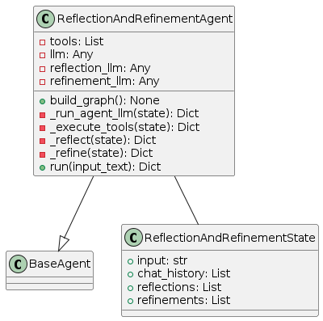
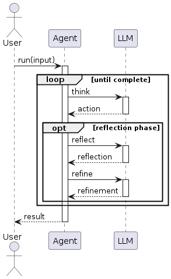
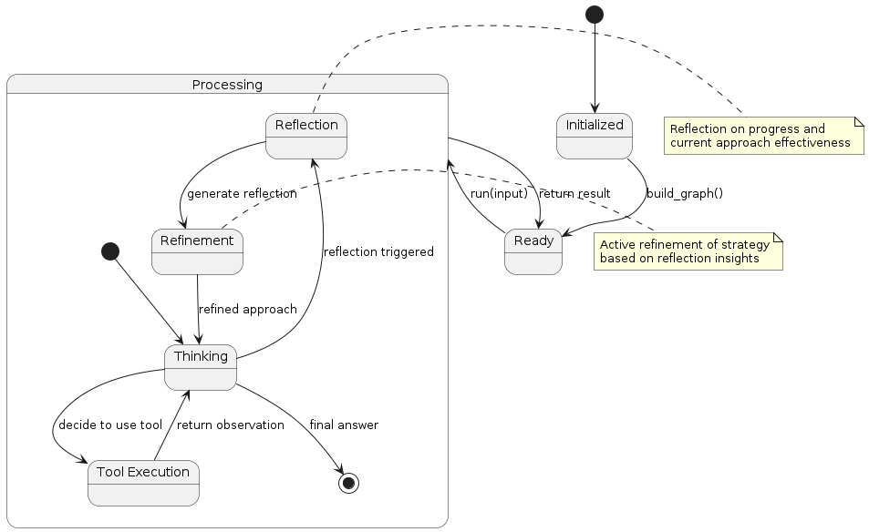

# Reflection and Refinement Pattern

## Overview
The Reflection and Refinement pattern extends the basic Reflection pattern by adding an explicit refinement phase. This pattern focuses on:

1. **Execution**: Standard reasoning and action execution
2. **Reflection**: Periodic analysis of progress and approach
3. **Refinement**: Explicit improvement of strategies based on reflections
4. **Adaptation**: Implementing refined approaches in subsequent execution

The key innovation is the structured refinement step that translates reflective insights into concrete improvements to the agent's approach.

## Diagrams

### Class Structure


The Reflection and Refinement pattern is implemented through:

- **ReflectionAndRefinementState**: Extends the basic agent state with reflections and refinements
- **ReflectionAndRefinementAgent**: Implements methods for reflection, refinement, and execution
- **BaseAgent**: The abstract base class from which the agent inherits

### Execution Flow


The execution flow follows:
1. User provides input to the agent
2. The agent processes the task through standard reasoning and tool execution
3. At predefined points, a reflection phase is triggered
4. The agent analyzes its progress and approach
5. A refinement phase follows, where the agent determines specific improvements
6. The agent adapts its approach based on these refinements
7. Execution continues with the improved approach
8. Final result is returned to the user

### State Transitions


The Reflection and Refinement pattern transitions through these states:
- **Initialized**: Agent is created but not yet ready
- **Ready**: Agent is ready to process input
- **Processing**: Agent is actively working on the task
  - **Thinking**: Agent is reasoning about what to do next
  - **Tool Execution**: Agent is using a tool
  - **Reflection**: Agent is analyzing progress and approach
  - **Refinement**: Agent is developing improved strategies
- Final state is reached when the agent determines a final answer

## Use Cases
- **Complex Problem Solving**: For problems requiring iterative improvement
- **Skill Acquisition**: When the agent needs to improve a skill during execution
- **Adaptive Learning**: For agents that need to evolve their strategies
- **Self-Improving Systems**: When continuous improvement is a design goal
- **Expert Systems**: For domains where expertise involves refining approaches
- **Novel Problem Domains**: When initial approaches may be suboptimal

## Implementation Guide

Here's a simple example of using the ReflectionAndRefinementAgent:

```python
from agent_patterns.patterns import ReflectionAndRefinementAgent
from agent_patterns.core.tools import ToolRegistry
from agent_patterns.core.memory import CompositeMemory, ProceduralMemory, SemanticMemory
from langchain.tools import tool

# Define tools
@tool
def search(query: str) -> str:
    """Search for information about a topic."""
    return f"Results for {query}: Some relevant information..."

@tool
def analyze(data: str) -> str:
    """Analyze data to extract insights."""
    return f"Analysis of '{data}': Several patterns detected..."

# Create tool registry
tool_registry = ToolRegistry([search, analyze])

# Create memory system
memory = CompositeMemory({
    "semantic": SemanticMemory(),    # For storing reflections
    "procedural": ProceduralMemory() # For storing refined approaches
})

# Configure the LLMs
llm_configs = {
    "default": {
        "provider": "openai",
        "model": "gpt-4o",
        "temperature": 0.7
    },
    "reflection": {
        "provider": "openai",
        "model": "gpt-4o",
        "temperature": 0.5
    },
    "refinement": {
        "provider": "openai",
        "model": "gpt-4o",
        "temperature": 0.3  # Lower temperature for more focused refinement
    }
}

# Initialize the agent
agent = ReflectionAndRefinementAgent(
    llm_configs=llm_configs,
    tool_provider=tool_registry,
    memory=memory,
    reflection_frequency=3,     # Reflect every 3 steps
    max_refinement_iterations=2 # Maximum number of refinements per task
)

# Run the agent
result = agent.run("Analyze climate data trends for the past decade and identify emerging patterns.")
print(result)
```

## Example References
The examples directory contains implementations of the Reflection and Refinement pattern:
- `examples/reflection_refinement_basic.py`: Basic implementation
- `examples/reflection_refinement_advanced.py`: Implementation with adaptive refinement

## Best Practices
- Design specialized prompts for the reflection and refinement phases
- Store reflections and refinements in memory for future reference
- Implement a mechanism to track refinement effectiveness
- Consider using different LLM configurations for reflection vs. refinement
- Structure refinement output to be actionable and concrete
- Balance refinement frequency against task progress
- Implement a "reflection on refinement" mechanism to evaluate improvement

## Related Patterns
- **Reflection Pattern**: Foundation that this pattern extends with refinement
- **Reflexion Pattern**: Similar but with different timing of reflection phases
- **STORM Pattern**: Both focus on improving agent reasoning and performance