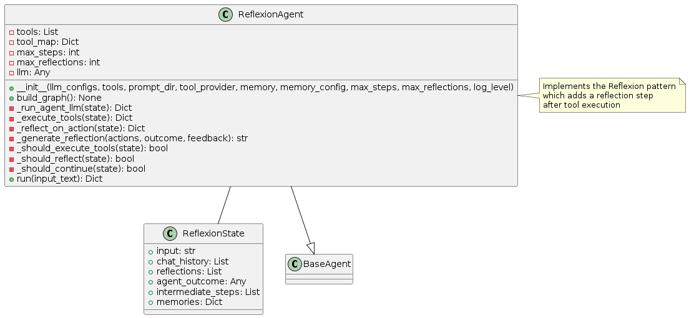
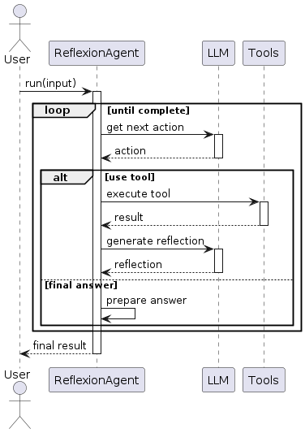
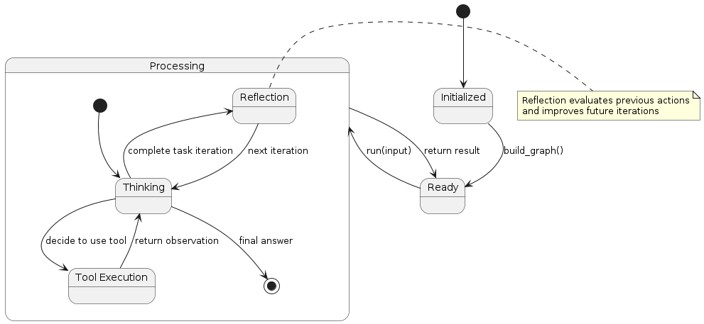

# Reflexion Pattern

## Overview
The Reflexion pattern extends the ReAct pattern by adding a reflection phase after action execution. This metacognitive capability allows the agent to learn from its own reasoning and actions, improving performance over time. The agent follows this cycle:

1. **Reasoning**: The LLM analyzes the current state and determines the next step
2. **Acting**: The agent executes an action based on its reasoning
3. **Observing**: The agent collects the result of the action
4. **Reflecting**: The agent analyzes what worked, what didn't, and how to improve
5. **Repeating**: The cycle continues with improved strategies

The key innovation in this pattern is the explicit reflection step, which allows the agent to improve its approach based on experience.

## Diagrams

### Class Structure


The Reflexion pattern is implemented through:

- **ReflexionState**: Extends the ReAct state with a reflections list to track insights
- **ReflexionAgent**: Extends the ReAct agent with reflection capabilities, including methods for generating and using reflections
- **BaseAgent**: The abstract base class from which all agent patterns inherit

### Execution Flow


The execution flow follows:
1. User provides input to the ReflexionAgent
2. Agent examines the input and determines a course of action
3. If a tool is needed, the agent executes it and receives the result
4. After tool execution, the agent reflects on what happened
5. These reflections inform the next iteration of reasoning
6. The cycle continues until a final answer is reached
7. Final answer is returned to the user

### State Transitions


The Reflexion pattern transitions through these states:
- **Initialized**: Agent is created but not yet ready
- **Ready**: Agent is ready to process input
- **Processing**: Agent is actively working on the task
  - **Thinking**: Agent is reasoning about what to do next
  - **Tool Execution**: Agent is using a tool
  - **Reflection**: Agent is reflecting on previous actions and outcomes
- Final state is reached when the agent determines a final answer

## Use Cases
- **Complex Problem Solving**: When problems require multiple attempts and refinement
- **Learning Tasks**: For agents that need to improve through experience
- **Error Recovery**: When initial approaches might fail and require correction
- **Optimization Problems**: For finding increasingly better solutions through iteration
- **Explorative Tasks**: When the environment or requirements are not fully known upfront

## Implementation Guide

Here's a simple example of using the ReflexionAgent:

```python
from agent_patterns.patterns import ReflexionAgent
from agent_patterns.core.tools import ToolRegistry
from agent_patterns.core.memory import CompositeMemory, EpisodicMemory
from langchain.tools import tool

# Define a simple tool
@tool
def search(query: str) -> str:
    """Search for information about a topic."""
    return f"Results for {query}: Some relevant information..."

# Create tool registry
tool_registry = ToolRegistry([search])

# Create memory system
memory = CompositeMemory({
    "episodic": EpisodicMemory(),
})

# Configure the LLMs
llm_configs = {
    "default": {
        "provider": "openai",
        "model": "gpt-4o",
        "temperature": 0.7
    }
}

# Initialize the Reflexion agent
agent = ReflexionAgent(
    llm_configs=llm_configs,
    tool_provider=tool_registry,
    memory=memory,
    max_reflections=3  # Maximum number of reflections per run
)

# Run the agent
result = agent.run("Solve this complex problem: determine the optimal route between cities A, B, and C.")
print(result)
```

## Example References
The examples directory contains implementations of the Reflexion pattern:
- `examples/reflexion_agent.py`: Complete Reflexion agent implementation
- `examples/reflexion_with_memory.py`: Reflexion agent with enhanced memory capabilities

## Best Practices
- Design reflection prompts that encourage critical thinking about previous steps
- Set an appropriate max_reflections value to balance improvement vs. efficiency
- Save reflections to memory for use in future, similar tasks
- Encourage the agent to identify specific improvements rather than general observations
- Structure reflection phases to focus on different aspects (logic errors, missed information, strategy)
- Consider using different LLM configurations for reflection vs. action steps

## Related Patterns
- **ReAct Pattern**: The foundation that Reflexion extends with reflection capabilities
- **Reflection and Refinement Pattern**: More structured approach to reflection with explicit refinement steps
- **STORM Pattern**: More comprehensive metacognitive framework that includes multiple evaluation steps