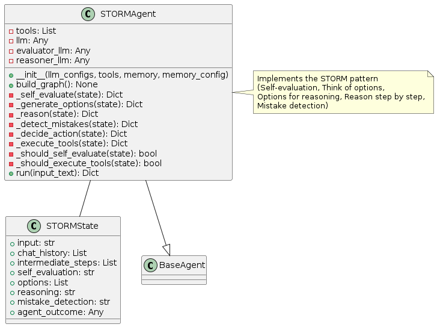
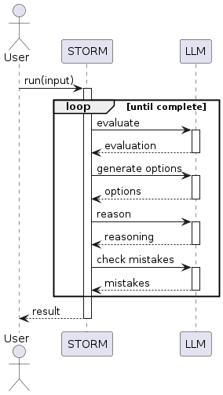
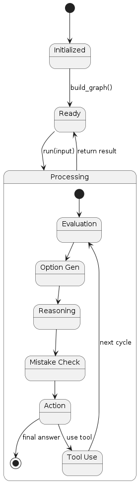

# STORM Pattern

## Overview
The STORM (Self-evaluation, Think of options, Options for reasoning, Reason step by step, Mistake detection) pattern implements a comprehensive metacognitive framework for agent reasoning. This pattern involves:

1. **Self-evaluation**: The agent evaluates its current understanding and approach
2. **Think of options**: Multiple solution options are generated
3. **Options for reasoning**: Different reasoning pathways are considered
4. **Reason step by step**: Detailed step-by-step reasoning is performed
5. **Mistake detection**: The agent actively looks for errors in its reasoning

The key innovation is the structured metacognitive process that emphasizes self-evaluation, exploring multiple options, and error detection.

## Diagrams

### Class Structure


The STORM pattern is implemented through:

- **STORMState**: Maintains state for self-evaluation, options, reasoning, and mistake detection
- **STORMAgent**: Implements the STORM metacognitive process
- **BaseAgent**: The abstract base class from which the STORM agent inherits

### Execution Flow


The execution flow follows:
1. User provides input to the STORMAgent
2. The agent performs self-evaluation of its understanding
3. Multiple solution options are generated
4. Detailed reasoning is performed for each option
5. The agent actively checks for potential mistakes in its reasoning
6. Based on this analysis, the agent decides on the best action
7. If needed, tools are executed
8. The cycle repeats until a final answer is determined
9. Final result is returned to the user

### State Transitions


The STORM pattern transitions through these states:
- **Initialized**: Agent is created but not yet ready
- **Ready**: Agent is ready to process input
- **Processing**: Agent is actively working on the task
  - **Self Evaluation**: Agent is evaluating its understanding
  - **Options Generation**: Agent is generating multiple approaches
  - **Reasoning**: Agent is reasoning through options in detail
  - **Mistake Detection**: Agent is checking for reasoning errors
  - **Action Decision**: Agent is selecting the best action
  - **Tool Execution**: Agent is using a tool if needed
- Final state is reached when the agent determines a final answer

## Use Cases
- **Critical Reasoning Tasks**: For problems requiring high accuracy and reliability
- **Complex Decision Making**: When multiple factors need careful consideration
- **Risk Assessment**: For situations where errors could have significant consequences
- **Expert Systems**: For domains requiring expert-level reasoning
- **Educational Applications**: For teaching structured reasoning approaches
- **Research Problems**: When thorough exploration of alternatives is important

## Implementation Guide

Here's a simple example of using the STORMAgent:

```python
from agent_patterns.patterns import STORMAgent
from agent_patterns.core.tools import ToolRegistry
from agent_patterns.core.memory import CompositeMemory, SemanticMemory
from langchain.tools import tool

# Define a few tools
@tool
def search(query: str) -> str:
    """Search for information about a topic."""
    return f"Results for {query}: Some relevant information..."

@tool
def verify_fact(statement: str) -> str:
    """Check if a statement is factually correct."""
    return f"Verification of '{statement}': [verification result]"

# Create tool registry
tool_registry = ToolRegistry([search, verify_fact])

# Create memory system
memory = CompositeMemory({
    "semantic": SemanticMemory()  # For storing reasoning patterns
})

# Configure the LLMs
llm_configs = {
    "default": {
        "provider": "openai",
        "model": "gpt-4o",
        "temperature": 0.7
    },
    "evaluator": {
        "provider": "openai",
        "model": "gpt-4o",
        "temperature": 0.4
    },
    "reasoner": {
        "provider": "openai",
        "model": "gpt-4o",
        "temperature": 0.3  # Lower temperature for more focused reasoning
    }
}

# Initialize the STORM agent
agent = STORMAgent(
    llm_configs=llm_configs,
    tool_provider=tool_registry,
    memory=memory
)

# Run the agent on a complex reasoning task
result = agent.run("Evaluate whether increasing interest rates will help control inflation in the current economic climate.")
print(result)
```

## Example References
The examples directory contains implementations of the STORM pattern:
- `examples/storm_basic.py`: Basic implementation of the STORM pattern
- `examples/storm_advanced.py`: Implementation with enhanced mistake detection

## Best Practices
- Design specialized prompts for each phase of the STORM process
- Consider using different LLM configurations for different STORM components
- Implement structured output formats for better tracking of the reasoning process
- Balance thoroughness against efficiency based on task requirements
- Store successful reasoning patterns in memory for future reference
- Implement a scoring system to evaluate different reasoning pathways
- Consider multi-turn conversation for complex reasoning tasks

## Related Patterns
- **Reflection Pattern**: STORM includes reflection as part of self-evaluation
- **ReWOO Pattern**: Both consider multiple options but with different approaches
- **Reflection and Refinement Pattern**: Similar metacognitive focus but different structure