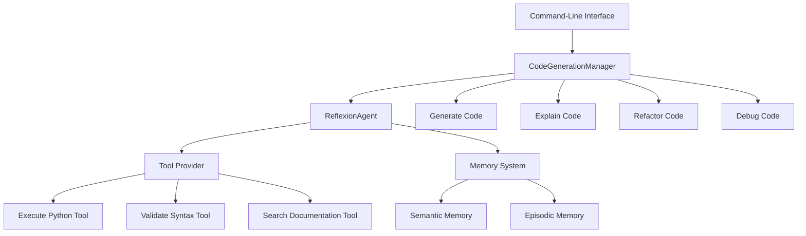

# Building a Code Generation Agent

This tutorial guides you through building an agent that can generate, explain, and refactor code based on user requests.

## Overview

Code generation agents need to:

1. Understand programming requirements from natural language descriptions
2. Generate code in various programming languages
3. Explain code functionality 
4. Debug and refactor existing code
5. Answer programming questions

For this use case, we'll use the Reflexion agent pattern, which excels at iterative refinement through self-reflection.

## Prerequisites

- Agent Patterns library installed
- OpenAI API key (or other supported LLM provider)
- Basic Python knowledge

## Step 1: Setting Up the Project

Create a new Python file called `code_generation_agent.py`:

```python
import os
import asyncio
from dotenv import load_dotenv
from agent_patterns.patterns.reflexion_agent import ReflexionAgent
from agent_patterns.core.memory import CompositeMemory, SemanticMemory, EpisodicMemory
from agent_patterns.core.memory.persistence import InMemoryPersistence
from agent_patterns.core.tools.base import BaseToolProvider, Tool

# Load environment variables
load_dotenv()
```

## Step 2: Creating Custom Tools

Create tools for code validation and execution:

```python
class CodeToolProvider(BaseToolProvider):
    """Tool provider for code-related operations."""
    
    def get_tools(self):
        """Return available tools."""
        return [
            Tool(
                name="execute_python",
                description="Execute Python code and return the output",
                function=self.execute_python,
                parameters={
                    "code": {
                        "type": "string",
                        "description": "Python code to execute"
                    }
                }
            ),
            Tool(
                name="validate_syntax",
                description="Validate the syntax of code without executing it",
                function=self.validate_syntax,
                parameters={
                    "code": {
                        "type": "string",
                        "description": "Code to validate"
                    },
                    "language": {
                        "type": "string",
                        "description": "Programming language",
                        "enum": ["python", "javascript", "java", "cpp", "go"]
                    }
                }
            ),
            Tool(
                name="search_documentation",
                description="Search programming documentation",
                function=self.search_documentation,
                parameters={
                    "query": {
                        "type": "string",
                        "description": "Search query"
                    },
                    "language": {
                        "type": "string",
                        "description": "Programming language",
                        "enum": ["python", "javascript", "java", "cpp", "go"]
                    }
                }
            )
        ]
    
    async def execute_python(self, code):
        """Execute Python code in a sandbox and return the result."""
        # IMPORTANT: In a real implementation, use secure sandboxing!
        # This is a simplified example for illustration purposes
        try:
            # Create a string buffer to capture stdout
            import io
            import sys
            from contextlib import redirect_stdout, redirect_stderr
            
            stdout_buffer = io.StringIO()
            stderr_buffer = io.StringIO()
            
            # Execute the code with captured output
            with redirect_stdout(stdout_buffer), redirect_stderr(stderr_buffer):
                # Set a timeout to prevent infinite loops
                import signal
                
                def handler(signum, frame):
                    raise TimeoutError("Code execution timed out")
                
                # Set 5-second timeout
                signal.signal(signal.SIGALRM, handler)
                signal.alarm(5)
                
                try:
                    # Execute the code in a restricted environment
                    # This is still not secure - use a proper sandbox in production
                    restricted_globals = {
                        "__builtins__": {
                            name: getattr(__builtins__, name)
                            for name in ['abs', 'all', 'any', 'bool', 'chr', 'dict', 
                                        'dir', 'enumerate', 'filter', 'float', 'format', 
                                        'frozenset', 'hash', 'hex', 'int', 'isinstance', 
                                        'issubclass', 'len', 'list', 'map', 'max', 'min', 
                                        'next', 'oct', 'ord', 'pow', 'print', 'range', 
                                        'repr', 'reversed', 'round', 'set', 'slice', 
                                        'sorted', 'str', 'sum', 'tuple', 'type', 'zip']
                        }
                    }
                    exec(code, restricted_globals, {})
                    
                    # Cancel the alarm
                    signal.alarm(0)
                except Exception as e:
                    return {"error": str(e), "type": type(e).__name__}
            
            # Get the output
            stdout = stdout_buffer.getvalue()
            stderr = stderr_buffer.getvalue()
            
            return {
                "stdout": stdout,
                "stderr": stderr,
                "success": not stderr
            }
        except TimeoutError as e:
            return {"error": str(e), "type": "TimeoutError"}
        except Exception as e:
            return {"error": f"Execution error: {str(e)}", "type": type(e).__name__}
    
    async def validate_syntax(self, code, language="python"):
        """Validate code syntax without executing it."""
        if language == "python":
            try:
                compile(code, "<string>", "exec")
                return {"valid": True, "message": "Syntax is valid"}
            except SyntaxError as e:
                return {
                    "valid": False,
                    "message": str(e),
                    "line": e.lineno,
                    "offset": e.offset,
                    "text": e.text
                }
        else:
            # For other languages, return a placeholder response
            # In a real implementation, you would use language-specific validators
            return {
                "valid": True,
                "message": f"Syntax validation for {language} is not implemented yet"
            }
    
    async def search_documentation(self, query, language="python"):
        """Search programming documentation (simulated)."""
        # This is a simulated documentation search
        # In a real implementation, you would query actual documentation sources
        
        # Simple mock documentation database
        python_docs = {
            "list": "Lists are used to store multiple items in a single variable.",
            "dictionary": "Dictionaries are used to store data values in key:value pairs.",
            "function": "A function is a block of code which only runs when it is called.",
            "class": "A class is a blueprint for creating objects."
        }
        
        javascript_docs = {
            "array": "Arrays are used to store multiple values in a single variable.",
            "object": "Objects are variables that can contain many values.",
            "function": "Functions are blocks of code designed to perform a particular task."
        }
        
        # Select the appropriate documentation set
        docs = {"python": python_docs, "javascript": javascript_docs}.get(
            language, {}
        )
        
        # Search for matching entries
        results = []
        query_terms = query.lower().split()
        
        for term, description in docs.items():
            for query_term in query_terms:
                if query_term in term.lower() or query_term in description.lower():
                    results.append({
                        "term": term,
                        "description": description
                    })
                    break
        
        return {
            "query": query,
            "language": language,
            "results": results,
            "result_count": len(results)
        }
```

## Step 3: Setting Up Memory

Set up both semantic and episodic memory to store code snippets and interactions:

```python
# Set up memory persistence
persistence = InMemoryPersistence()
asyncio.run(persistence.initialize())

# Create memory components
semantic_memory = SemanticMemory(
    persistence, 
    namespace="code_knowledge"
)

episodic_memory = EpisodicMemory(
    persistence, 
    namespace="coding_interactions"
)

# Create composite memory
memory = CompositeMemory({
    "semantic": semantic_memory,
    "episodic": episodic_memory
})
```

## Step 4: Creating the Code Generation Agent

Now, let's create our Reflexion-based code generation agent:

```python
# Configure LLM settings
llm_configs = {
    "default": {
        "provider": os.getenv("DEFAULT_MODEL_PROVIDER", "openai"),
        "model_name": os.getenv("DEFAULT_MODEL_NAME", "gpt-4o")
    },
    "reflection": {
        "provider": os.getenv("REFLECTION_MODEL_PROVIDER", "anthropic"),
        "model_name": os.getenv("REFLECTION_MODEL_NAME", "claude-3-opus-20240229")
    }
}

# Create tool provider
code_tool_provider = CodeToolProvider()

# Create code generation agent
code_agent = ReflexionAgent(
    llm_configs=llm_configs,
    memory=memory,
    memory_config={
        "semantic": True,
        "episodic": True
    },
    tool_provider=code_tool_provider,
    reflection_config={
        "reflection_threshold": 0.7,  # Threshold to trigger reflection
        "max_reflections": 3,         # Maximum number of reflection rounds
        "reflection_prompt": "Consider the code quality, efficiency, and edge cases."
    }
)
```

## Step 5: Creating a Code Generation Manager

Let's create a manager class to handle different code generation tasks:

```python
class CodeGenerationManager:
    def __init__(self):
        self.agent = code_agent
        self.code_history = {}
    
    def generate_code(self, task_description, language="python"):
        """Generate code based on a task description."""
        prompt = f"""
        Act as an expert programmer. Generate {language} code for the following task:
        
        {task_description}
        
        The code should be:
        1. Well-documented with comments
        2. Efficient and optimized
        3. Handle edge cases and errors
        4. Follow best practices for {language}
        
        Return only the code without explanations.
        """
        
        code = self.agent.run(prompt)
        
        # Store in history
        task_id = self._generate_id()
        self.code_history[task_id] = {
            "task": task_description,
            "language": language,
            "code": code,
            "generated_at": self._get_timestamp()
        }
        
        # Store in semantic memory
        asyncio.run(semantic_memory.save({
            "entity": f"code:{task_id}",
            "attribute": "task",
            "value": task_description
        }))
        
        asyncio.run(semantic_memory.save({
            "entity": f"code:{task_id}",
            "attribute": "language",
            "value": language
        }))
        
        asyncio.run(semantic_memory.save({
            "entity": f"code:{task_id}",
            "attribute": "code",
            "value": code
        }))
        
        return {
            "task_id": task_id,
            "code": code
        }
    
    def explain_code(self, code, language="python"):
        """Explain the functionality of provided code."""
        prompt = f"""
        Act as an expert programmer. Explain the following {language} code in detail:
        
        ```{language}
        {code}
        ```
        
        Your explanation should:
        1. Describe what the code does at a high level
        2. Explain important functions and sections
        3. Identify any potential issues or improvements
        4. Explain the algorithms or data structures used
        """
        
        explanation = self.agent.run(prompt)
        return explanation
    
    def refactor_code(self, code, requirements, language="python"):
        """Refactor code based on specified requirements."""
        prompt = f"""
        Act as an expert programmer. Refactor the following {language} code 
        according to these requirements:
        
        ```{language}
        {code}
        ```
        
        Requirements:
        {requirements}
        
        Provide the refactored code and a brief explanation of the changes made.
        """
        
        result = self.agent.run(prompt)
        return result
    
    def debug_code(self, code, error_message, language="python"):
        """Debug code based on an error message."""
        prompt = f"""
        Act as an expert programmer. Debug the following {language} code that
        produces this error:
        
        ```{language}
        {code}
        ```
        
        Error message:
        {error_message}
        
        Find the issue, explain it, and provide the corrected code.
        """
        
        debug_result = self.agent.run(prompt)
        return debug_result
    
    def _generate_id(self):
        """Generate a unique ID for a code task."""
        import uuid
        return str(uuid.uuid4())[:8]
    
    def _get_timestamp(self):
        """Get the current timestamp."""
        import datetime
        return datetime.datetime.now().isoformat()
```

## Step 6: Creating a CLI Interface

Let's create a command-line interface to use our code generation agent:

```python
def main():
    # Create the code generation manager
    manager = CodeGenerationManager()
    
    print("Code Generation Agent")
    print("=" * 50)
    print("1. Generate Code")
    print("2. Explain Code")
    print("3. Refactor Code")
    print("4. Debug Code")
    print("5. Exit")
    
    while True:
        choice = input("\nSelect an option (1-5): ")
        
        if choice == "1":
            task = input("Describe the code you want to generate: ")
            language = input("Programming language (default: python): ") or "python"
            
            print("\nGenerating code...")
            result = manager.generate_code(task, language)
            
            print("\nGenerated Code:")
            print("-" * 50)
            print(result["code"])
            print("-" * 50)
            print(f"Task ID: {result['task_id']}")
        
        elif choice == "2":
            code = input("Enter or paste the code to explain: ")
            language = input("Programming language (default: python): ") or "python"
            
            print("\nExplaining code...")
            explanation = manager.explain_code(code, language)
            
            print("\nExplanation:")
            print("-" * 50)
            print(explanation)
            print("-" * 50)
        
        elif choice == "3":
            code = input("Enter or paste the code to refactor: ")
            requirements = input("Enter refactoring requirements: ")
            language = input("Programming language (default: python): ") or "python"
            
            print("\nRefactoring code...")
            result = manager.refactor_code(code, requirements, language)
            
            print("\nRefactoring Result:")
            print("-" * 50)
            print(result)
            print("-" * 50)
        
        elif choice == "4":
            code = input("Enter or paste the code to debug: ")
            error = input("Enter the error message: ")
            language = input("Programming language (default: python): ") or "python"
            
            print("\nDebugging code...")
            result = manager.debug_code(code, error, language)
            
            print("\nDebugging Result:")
            print("-" * 50)
            print(result)
            print("-" * 50)
        
        elif choice == "5":
            print("Exiting...")
            break
        
        else:
            print("Invalid choice. Please select 1-5.")

if __name__ == "__main__":
    main()
```

## Complete Code

Here's the complete code for our code generation agent:

```python
import os
import asyncio
import datetime
import uuid
from dotenv import load_dotenv
from agent_patterns.patterns.reflexion_agent import ReflexionAgent
from agent_patterns.core.memory import CompositeMemory, SemanticMemory, EpisodicMemory
from agent_patterns.core.memory.persistence import InMemoryPersistence
from agent_patterns.core.tools.base import BaseToolProvider, Tool

# Load environment variables
load_dotenv()

class CodeToolProvider(BaseToolProvider):
    """Tool provider for code-related operations."""
    
    def get_tools(self):
        """Return available tools."""
        return [
            Tool(
                name="execute_python",
                description="Execute Python code and return the output",
                function=self.execute_python,
                parameters={
                    "code": {
                        "type": "string",
                        "description": "Python code to execute"
                    }
                }
            ),
            Tool(
                name="validate_syntax",
                description="Validate the syntax of code without executing it",
                function=self.validate_syntax,
                parameters={
                    "code": {
                        "type": "string",
                        "description": "Code to validate"
                    },
                    "language": {
                        "type": "string",
                        "description": "Programming language",
                        "enum": ["python", "javascript", "java", "cpp", "go"]
                    }
                }
            ),
            Tool(
                name="search_documentation",
                description="Search programming documentation",
                function=self.search_documentation,
                parameters={
                    "query": {
                        "type": "string",
                        "description": "Search query"
                    },
                    "language": {
                        "type": "string",
                        "description": "Programming language",
                        "enum": ["python", "javascript", "java", "cpp", "go"]
                    }
                }
            )
        ]
    
    async def execute_python(self, code):
        """Execute Python code in a sandbox and return the result."""
        # IMPORTANT: In a real implementation, use secure sandboxing!
        # This is a simplified example for illustration purposes
        try:
            # Create a string buffer to capture stdout
            import io
            import sys
            from contextlib import redirect_stdout, redirect_stderr
            
            stdout_buffer = io.StringIO()
            stderr_buffer = io.StringIO()
            
            # Execute the code with captured output
            with redirect_stdout(stdout_buffer), redirect_stderr(stderr_buffer):
                # Set a timeout to prevent infinite loops
                import signal
                
                def handler(signum, frame):
                    raise TimeoutError("Code execution timed out")
                
                # Set 5-second timeout
                signal.signal(signal.SIGALRM, handler)
                signal.alarm(5)
                
                try:
                    # Execute the code in a restricted environment
                    # This is still not secure - use a proper sandbox in production
                    restricted_globals = {
                        "__builtins__": {
                            name: getattr(__builtins__, name)
                            for name in ['abs', 'all', 'any', 'bool', 'chr', 'dict', 
                                        'dir', 'enumerate', 'filter', 'float', 'format', 
                                        'frozenset', 'hash', 'hex', 'int', 'isinstance', 
                                        'issubclass', 'len', 'list', 'map', 'max', 'min', 
                                        'next', 'oct', 'ord', 'pow', 'print', 'range', 
                                        'repr', 'reversed', 'round', 'set', 'slice', 
                                        'sorted', 'str', 'sum', 'tuple', 'type', 'zip']
                        }
                    }
                    exec(code, restricted_globals, {})
                    
                    # Cancel the alarm
                    signal.alarm(0)
                except Exception as e:
                    return {"error": str(e), "type": type(e).__name__}
            
            # Get the output
            stdout = stdout_buffer.getvalue()
            stderr = stderr_buffer.getvalue()
            
            return {
                "stdout": stdout,
                "stderr": stderr,
                "success": not stderr
            }
        except TimeoutError as e:
            return {"error": str(e), "type": "TimeoutError"}
        except Exception as e:
            return {"error": f"Execution error: {str(e)}", "type": type(e).__name__}
    
    async def validate_syntax(self, code, language="python"):
        """Validate code syntax without executing it."""
        if language == "python":
            try:
                compile(code, "<string>", "exec")
                return {"valid": True, "message": "Syntax is valid"}
            except SyntaxError as e:
                return {
                    "valid": False,
                    "message": str(e),
                    "line": e.lineno,
                    "offset": e.offset,
                    "text": e.text
                }
        else:
            # For other languages, return a placeholder response
            # In a real implementation, you would use language-specific validators
            return {
                "valid": True,
                "message": f"Syntax validation for {language} is not implemented yet"
            }
    
    async def search_documentation(self, query, language="python"):
        """Search programming documentation (simulated)."""
        # This is a simulated documentation search
        # In a real implementation, you would query actual documentation sources
        
        # Simple mock documentation database
        python_docs = {
            "list": "Lists are used to store multiple items in a single variable.",
            "dictionary": "Dictionaries are used to store data values in key:value pairs.",
            "function": "A function is a block of code which only runs when it is called.",
            "class": "A class is a blueprint for creating objects."
        }
        
        javascript_docs = {
            "array": "Arrays are used to store multiple values in a single variable.",
            "object": "Objects are variables that can contain many values.",
            "function": "Functions are blocks of code designed to perform a particular task."
        }
        
        # Select the appropriate documentation set
        docs = {"python": python_docs, "javascript": javascript_docs}.get(
            language, {}
        )
        
        # Search for matching entries
        results = []
        query_terms = query.lower().split()
        
        for term, description in docs.items():
            for query_term in query_terms:
                if query_term in term.lower() or query_term in description.lower():
                    results.append({
                        "term": term,
                        "description": description
                    })
                    break
        
        return {
            "query": query,
            "language": language,
            "results": results,
            "result_count": len(results)
        }

# Set up memory persistence
persistence = InMemoryPersistence()
asyncio.run(persistence.initialize())

# Create memory components
semantic_memory = SemanticMemory(
    persistence, 
    namespace="code_knowledge"
)

episodic_memory = EpisodicMemory(
    persistence, 
    namespace="coding_interactions"
)

# Create composite memory
memory = CompositeMemory({
    "semantic": semantic_memory,
    "episodic": episodic_memory
})

# Configure LLM settings
llm_configs = {
    "default": {
        "provider": os.getenv("DEFAULT_MODEL_PROVIDER", "openai"),
        "model_name": os.getenv("DEFAULT_MODEL_NAME", "gpt-4o")
    },
    "reflection": {
        "provider": os.getenv("REFLECTION_MODEL_PROVIDER", "anthropic"),
        "model_name": os.getenv("REFLECTION_MODEL_NAME", "claude-3-opus-20240229")
    }
}

# Create tool provider
code_tool_provider = CodeToolProvider()

# Create code generation agent
code_agent = ReflexionAgent(
    llm_configs=llm_configs,
    memory=memory,
    memory_config={
        "semantic": True,
        "episodic": True
    },
    tool_provider=code_tool_provider,
    reflection_config={
        "reflection_threshold": 0.7,  # Threshold to trigger reflection
        "max_reflections": 3,         # Maximum number of reflection rounds
        "reflection_prompt": "Consider the code quality, efficiency, and edge cases."
    }
)

class CodeGenerationManager:
    def __init__(self):
        self.agent = code_agent
        self.code_history = {}
    
    def generate_code(self, task_description, language="python"):
        """Generate code based on a task description."""
        prompt = f"""
        Act as an expert programmer. Generate {language} code for the following task:
        
        {task_description}
        
        The code should be:
        1. Well-documented with comments
        2. Efficient and optimized
        3. Handle edge cases and errors
        4. Follow best practices for {language}
        
        Return only the code without explanations.
        """
        
        code = self.agent.run(prompt)
        
        # Store in history
        task_id = self._generate_id()
        self.code_history[task_id] = {
            "task": task_description,
            "language": language,
            "code": code,
            "generated_at": self._get_timestamp()
        }
        
        # Store in semantic memory
        asyncio.run(semantic_memory.save({
            "entity": f"code:{task_id}",
            "attribute": "task",
            "value": task_description
        }))
        
        asyncio.run(semantic_memory.save({
            "entity": f"code:{task_id}",
            "attribute": "language",
            "value": language
        }))
        
        asyncio.run(semantic_memory.save({
            "entity": f"code:{task_id}",
            "attribute": "code",
            "value": code
        }))
        
        return {
            "task_id": task_id,
            "code": code
        }
    
    def explain_code(self, code, language="python"):
        """Explain the functionality of provided code."""
        prompt = f"""
        Act as an expert programmer. Explain the following {language} code in detail:
        
        ```{language}
        {code}
        ```
        
        Your explanation should:
        1. Describe what the code does at a high level
        2. Explain important functions and sections
        3. Identify any potential issues or improvements
        4. Explain the algorithms or data structures used
        """
        
        explanation = self.agent.run(prompt)
        return explanation
    
    def refactor_code(self, code, requirements, language="python"):
        """Refactor code based on specified requirements."""
        prompt = f"""
        Act as an expert programmer. Refactor the following {language} code 
        according to these requirements:
        
        ```{language}
        {code}
        ```
        
        Requirements:
        {requirements}
        
        Provide the refactored code and a brief explanation of the changes made.
        """
        
        result = self.agent.run(prompt)
        return result
    
    def debug_code(self, code, error_message, language="python"):
        """Debug code based on an error message."""
        prompt = f"""
        Act as an expert programmer. Debug the following {language} code that
        produces this error:
        
        ```{language}
        {code}
        ```
        
        Error message:
        {error_message}
        
        Find the issue, explain it, and provide the corrected code.
        """
        
        debug_result = self.agent.run(prompt)
        return debug_result
    
    def _generate_id(self):
        """Generate a unique ID for a code task."""
        return str(uuid.uuid4())[:8]
    
    def _get_timestamp(self):
        """Get the current timestamp."""
        return datetime.datetime.now().isoformat()

def main():
    # Create the code generation manager
    manager = CodeGenerationManager()
    
    print("Code Generation Agent")
    print("=" * 50)
    print("1. Generate Code")
    print("2. Explain Code")
    print("3. Refactor Code")
    print("4. Debug Code")
    print("5. Exit")
    
    while True:
        choice = input("\nSelect an option (1-5): ")
        
        if choice == "1":
            task = input("Describe the code you want to generate: ")
            language = input("Programming language (default: python): ") or "python"
            
            print("\nGenerating code...")
            result = manager.generate_code(task, language)
            
            print("\nGenerated Code:")
            print("-" * 50)
            print(result["code"])
            print("-" * 50)
            print(f"Task ID: {result['task_id']}")
        
        elif choice == "2":
            code = input("Enter or paste the code to explain: ")
            language = input("Programming language (default: python): ") or "python"
            
            print("\nExplaining code...")
            explanation = manager.explain_code(code, language)
            
            print("\nExplanation:")
            print("-" * 50)
            print(explanation)
            print("-" * 50)
        
        elif choice == "3":
            code = input("Enter or paste the code to refactor: ")
            requirements = input("Enter refactoring requirements: ")
            language = input("Programming language (default: python): ") or "python"
            
            print("\nRefactoring code...")
            result = manager.refactor_code(code, requirements, language)
            
            print("\nRefactoring Result:")
            print("-" * 50)
            print(result)
            print("-" * 50)
        
        elif choice == "4":
            code = input("Enter or paste the code to debug: ")
            error = input("Enter the error message: ")
            language = input("Programming language (default: python): ") or "python"
            
            print("\nDebugging code...")
            result = manager.debug_code(code, error, language)
            
            print("\nDebugging Result:")
            print("-" * 50)
            print(result)
            print("-" * 50)
        
        elif choice == "5":
            print("Exiting...")
            break
        
        else:
            print("Invalid choice. Please select 1-5.")

if __name__ == "__main__":
    main()
```

## Architecture Diagram



## Next Steps

You can enhance this code generation agent with:

1. **Language Server Protocol Integration**: Connect to LSP for accurate code analysis
2. **Version Control Integration**: Automatically commit generated code to repositories
3. **Test Generation**: Automatically generate unit tests for code
4. **IDE Plugin**: Create plugins for popular IDEs like VS Code
5. **Web Interface**: Build a web interface for easier interaction

By using the Reflexion agent pattern, our code generation agent benefits from:
- Self-improvement through reflection
- Multiple rounds of revision to enhance code quality
- Learning from past interactions to generate better code
- Tool usage for validating and testing code

This approach creates a code generation agent that not only generates code but also explains, refactors, and debugs it with increasing quality over time.