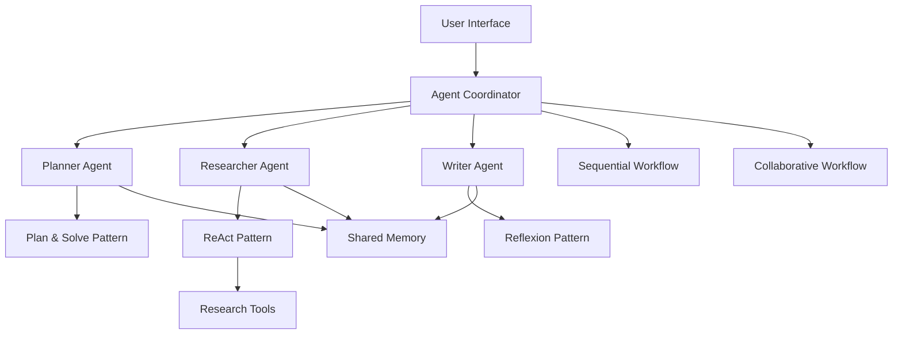

# Building a Multi-Agent System

This tutorial guides you through building a collaborative multi-agent system where specialized agents work together on complex tasks.

## Overview

Multi-agent systems need to:

1. Assign tasks to specialized agents based on their capabilities
2. Coordinate communication between agents
3. Resolve conflicts and integrate outputs from different agents
4. Maintain a shared context across the entire system
5. Orchestrate the workflow to achieve the main goal

We'll create a system of specialized agents using different agent patterns based on their roles.

## Prerequisites

- Agent Patterns library installed
- OpenAI API key (or other supported LLM provider)
- Basic Python knowledge

## Step 1: Setting Up the Project

Create a new Python file called `multi_agent_system.py`:

```python
import os
import asyncio
from dotenv import load_dotenv
from agent_patterns.patterns.re_act_agent import ReActAgent
from agent_patterns.patterns.reflexion_agent import ReflexionAgent
from agent_patterns.patterns.plan_and_solve_agent import PlanAndSolveAgent
from agent_patterns.core.memory import CompositeMemory, SemanticMemory
from agent_patterns.core.memory.persistence import InMemoryPersistence
from agent_patterns.core.tools.base import BaseToolProvider, Tool

# Load environment variables
load_dotenv()
```

## Step 2: Creating the Memory System

We'll create a shared memory system for our agents:

```python
# Set up memory persistence
persistence = InMemoryPersistence()
asyncio.run(persistence.initialize())

# Create shared memory
shared_memory = SemanticMemory(
    persistence, 
    namespace="shared_knowledge"
)

# Create composite memory
memory = CompositeMemory({
    "shared": shared_memory
})
```

## Step 3: Creating Specialized Agents

Let's create three specialized agents with different capabilities:

```python
# Configure LLM settings
llm_configs = {
    "default": {
        "provider": os.getenv("DEFAULT_MODEL_PROVIDER", "openai"),
        "model_name": os.getenv("DEFAULT_MODEL_NAME", "gpt-4o")
    },
    "planning": {
        "provider": os.getenv("PLANNING_MODEL_PROVIDER", "anthropic"),
        "model_name": os.getenv("PLANNING_MODEL_NAME", "claude-3-opus-20240229")
    }
}

# Create the planner agent
planner_agent = PlanAndSolveAgent(
    llm_configs=llm_configs,
    memory=memory,
    memory_config={"shared": True}
)

# Create the researcher agent
researcher_agent = ReActAgent(
    llm_configs=llm_configs,
    memory=memory,
    memory_config={"shared": True}
)

# Create the writer agent
writer_agent = ReflexionAgent(
    llm_configs=llm_configs,
    memory=memory,
    memory_config={"shared": True},
    reflection_config={
        "reflection_threshold": 0.7,
        "max_reflections": 2
    }
)
```

## Step 4: Creating the Agent Coordinator

Now, let's create a coordinator to manage our agents:

```python
class AgentCoordinator:
    def __init__(self):
        self.planner = planner_agent
        self.researcher = researcher_agent
        self.writer = writer_agent
        self.task_state = {}
    
    def process_task(self, task_description):
        """Process a complex task using multiple agents."""
        task_id = self._generate_id()
        self.task_state[task_id] = {
            "description": task_description,
            "status": "planning",
            "plan": None,
            "research": None,
            "draft": None,
            "final_output": None
        }
        
        # Step 1: Create a plan
        plan = self._create_plan(task_id, task_description)
        
        # Step 2: Conduct research
        research = self._conduct_research(task_id, task_description, plan)
        
        # Step 3: Generate content
        draft = self._generate_content(task_id, task_description, plan, research)
        
        # Step 4: Refine and finalize
        final_output = self._refine_content(task_id, draft)
        
        # Update task state
        self.task_state[task_id]["status"] = "completed"
        self.task_state[task_id]["final_output"] = final_output
        
        return {
            "task_id": task_id,
            "result": final_output
        }
    
    def _create_plan(self, task_id, task_description):
        """Use the planner agent to create a plan."""
        prompt = f"""
        Create a detailed plan to complete this task:
        
        {task_description}
        
        Break it down into steps with clear objectives for each step.
        Identify what research is needed and what should be included in the final output.
        """
        
        plan = self.planner.run(prompt)
        
        # Save to task state
        self.task_state[task_id]["status"] = "researching"
        self.task_state[task_id]["plan"] = plan
        
        # Save to shared memory
        asyncio.run(shared_memory.save({
            "entity": f"task:{task_id}",
            "attribute": "plan",
            "value": plan
        }))
        
        return plan
    
    def _conduct_research(self, task_id, task_description, plan):
        """Use the researcher agent to gather information."""
        prompt = f"""
        Conduct research for the following task:
        
        {task_description}
        
        Using this plan:
        {plan}
        
        Gather relevant information, data, and facts needed to complete the task.
        Focus on finding reliable and accurate information.
        """
        
        research = self.researcher.run(prompt)
        
        # Save to task state
        self.task_state[task_id]["status"] = "writing"
        self.task_state[task_id]["research"] = research
        
        # Save to shared memory
        asyncio.run(shared_memory.save({
            "entity": f"task:{task_id}",
            "attribute": "research",
            "value": research
        }))
        
        return research
    
    def _generate_content(self, task_id, task_description, plan, research):
        """Use the writer agent to generate content."""
        prompt = f"""
        Create content for the following task:
        
        {task_description}
        
        Using this plan:
        {plan}
        
        And this research:
        {research}
        
        Generate well-structured, clear, and accurate content that fulfills the task requirements.
        """
        
        draft = self.writer.run(prompt)
        
        # Save to task state
        self.task_state[task_id]["status"] = "refining"
        self.task_state[task_id]["draft"] = draft
        
        # Save to shared memory
        asyncio.run(shared_memory.save({
            "entity": f"task:{task_id}",
            "attribute": "draft",
            "value": draft
        }))
        
        return draft
    
    def _refine_content(self, task_id, draft):
        """Use the writer agent to refine the content."""
        prompt = f"""
        Refine and improve the following draft:
        
        {draft}
        
        Check for:
        1. Accuracy and completeness
        2. Clarity and coherence
        3. Grammar and style
        4. Alignment with the original task requirements
        
        Provide the improved version.
        """
        
        final_output = self.writer.run(prompt)
        
        # Save to shared memory
        asyncio.run(shared_memory.save({
            "entity": f"task:{task_id}",
            "attribute": "final_output",
            "value": final_output
        }))
        
        return final_output
    
    def get_task_status(self, task_id):
        """Get the current status of a task."""
        if task_id not in self.task_state:
            return {"error": "Task not found"}
        
        return self.task_state[task_id]
    
    def _generate_id(self):
        """Generate a unique ID for a task."""
        import uuid
        return str(uuid.uuid4())[:8]
```

## Step 5: Creating a User Interface

Let's create a simple interface for our multi-agent system:

```python
def main():
    # Create the agent coordinator
    coordinator = AgentCoordinator()
    
    print("Multi-Agent System")
    print("=" * 50)
    print("This system uses multiple specialized agents to complete complex tasks.")
    
    # Get task from user
    task = input("\nEnter your task description: ")
    
    # Process the task
    print("\nProcessing task...")
    print("This may take some time depending on the complexity of the task.")
    
    # Display progress indicators
    print("\nProgress:")
    print("- Planning...")
    # Process the task with the coordinator
    result = coordinator.process_task(task)
    
    # Display the result
    print("\nTask Completed!")
    print("=" * 50)
    print(result["result"])
    print("=" * 50)
    print(f"Task ID: {result['task_id']}")
    
    # Option to save the result
    save_option = input("\nWould you like to save the result to a file? (y/n): ")
    if save_option.lower() == 'y':
        filename = input("Enter filename (default: result.txt): ") or "result.txt"
        
        try:
            with open(filename, "w") as f:
                f.write(result["result"])
            print(f"Result saved to {filename}")
        except Exception as e:
            print(f"Error saving file: {str(e)}")

if __name__ == "__main__":
    main()
```

## Step 6: Adding Agent-Specific Tools

Let's enhance our agents with specialized tools:

```python
# Create a tool provider for the researcher agent
class ResearchToolProvider(BaseToolProvider):
    def get_tools(self):
        return [
            Tool(
                name="search_web",
                description="Search the web for information",
                function=self.search_web,
                parameters={
                    "query": {
                        "type": "string",
                        "description": "The search query"
                    }
                }
            ),
            Tool(
                name="summarize_text",
                description="Summarize long text",
                function=self.summarize_text,
                parameters={
                    "text": {
                        "type": "string",
                        "description": "The text to summarize"
                    }
                }
            )
        ]
    
    async def search_web(self, query):
        """Simulate web search."""
        # In a real implementation, this would connect to a search API
        return {
            "query": query,
            "results": [
                {
                    "title": f"Result for {query} - Example 1",
                    "snippet": f"This is a simulated search result for {query}."
                },
                {
                    "title": f"Result for {query} - Example 2",
                    "snippet": f"Another simulated search result for {query}."
                }
            ]
        }
    
    async def summarize_text(self, text):
        """Simulate text summarization."""
        # In a real implementation, this could use a dedicated summarization model
        return {
            "original_length": len(text),
            "summary": f"Summary of the provided text: {text[:100]}..."
        }

# Update the researcher agent with the tool provider
researcher_agent = ReActAgent(
    llm_configs=llm_configs,
    memory=memory,
    memory_config={"shared": True},
    tool_provider=ResearchToolProvider()
)
```

Now, let's update our AgentCoordinator to include a more collaborative workflow:

```python
# Add this method to the AgentCoordinator class
def collaborative_task(self, task_description):
    """Process a task using a more collaborative approach."""
    task_id = self._generate_id()
    self.task_state[task_id] = {
        "description": task_description,
        "status": "planning",
        "agent_outputs": {},
        "final_output": None
    }
    
    # Step 1: Planner creates initial plan
    plan_prompt = f"Create a plan to address this task: {task_description}"
    initial_plan = self.planner.run(plan_prompt)
    
    # Save planner output
    self.task_state[task_id]["agent_outputs"]["planner"] = initial_plan
    
    # Step 2: Researcher reviews plan and adds research
    research_prompt = f"""
    Review this plan and conduct necessary research:
    
    TASK: {task_description}
    
    PLAN: {initial_plan}
    
    Add any information, data, or facts needed to complete this task.
    """
    research_output = self.researcher.run(research_prompt)
    
    # Save researcher output
    self.task_state[task_id]["agent_outputs"]["researcher"] = research_output
    
    # Step 3: Planner refines plan based on research
    refine_prompt = f"""
    Refine your original plan based on this research:
    
    ORIGINAL PLAN: {initial_plan}
    
    RESEARCH: {research_output}
    
    Provide an updated plan that incorporates the research findings.
    """
    refined_plan = self.planner.run(refine_prompt)
    
    # Save refined plan
    self.task_state[task_id]["agent_outputs"]["refined_plan"] = refined_plan
    
    # Step 4: Writer creates content based on refined plan and research
    write_prompt = f"""
    Create content to address this task:
    
    TASK: {task_description}
    
    REFINED PLAN: {refined_plan}
    
    RESEARCH: {research_output}
    
    Provide well-structured content that fulfills the requirements.
    """
    draft = self.writer.run(write_prompt)
    
    # Save draft
    self.task_state[task_id]["agent_outputs"]["draft"] = draft
    
    # Step 5: All agents review and provide feedback
    # Planner review
    planner_review_prompt = f"""
    Review this draft and evaluate if it fulfills the plan:
    
    TASK: {task_description}
    PLAN: {refined_plan}
    DRAFT: {draft}
    
    Identify any missing elements or areas for improvement.
    """
    planner_feedback = self.planner.run(planner_review_prompt)
    
    # Researcher review
    researcher_review_prompt = f"""
    Review this draft and evaluate if it accurately uses the research:
    
    TASK: {task_description}
    RESEARCH: {research_output}
    DRAFT: {draft}
    
    Identify any factual errors or missing information.
    """
    researcher_feedback = self.researcher.run(researcher_review_prompt)
    
    # Save feedback
    self.task_state[task_id]["agent_outputs"]["planner_feedback"] = planner_feedback
    self.task_state[task_id]["agent_outputs"]["researcher_feedback"] = researcher_feedback
    
    # Step 6: Writer improves draft based on feedback
    improve_prompt = f"""
    Improve this draft based on feedback:
    
    DRAFT: {draft}
    
    PLANNER FEEDBACK: {planner_feedback}
    
    RESEARCHER FEEDBACK: {researcher_feedback}
    
    Provide an improved version that addresses all feedback.
    """
    improved_draft = self.writer.run(improve_prompt)
    
    # Save improved draft
    self.task_state[task_id]["agent_outputs"]["improved_draft"] = improved_draft
    
    # Step 7: Final review and polishing
    final_prompt = f"""
    This is the final review of the content:
    
    TASK: {task_description}
    
    CONTENT: {improved_draft}
    
    Perform a final polish, ensuring the content is complete, accurate,
    well-organized, and fully addresses the original task.
    """
    final_output = self.writer.run(final_prompt)
    
    # Update task state
    self.task_state[task_id]["status"] = "completed"
    self.task_state[task_id]["final_output"] = final_output
    
    # Save to shared memory
    asyncio.run(shared_memory.save({
        "entity": f"task:{task_id}",
        "attribute": "final_output",
        "value": final_output
    }))
    
    return {
        "task_id": task_id,
        "result": final_output
    }
```

## Complete Code

Here's a simplified version of the complete code:

```python
import os
import asyncio
import uuid
from dotenv import load_dotenv
from agent_patterns.patterns.re_act_agent import ReActAgent
from agent_patterns.patterns.reflexion_agent import ReflexionAgent
from agent_patterns.patterns.plan_and_solve_agent import PlanAndSolveAgent
from agent_patterns.core.memory import CompositeMemory, SemanticMemory
from agent_patterns.core.memory.persistence import InMemoryPersistence
from agent_patterns.core.tools.base import BaseToolProvider, Tool

# Load environment variables
load_dotenv()

class ResearchToolProvider(BaseToolProvider):
    def get_tools(self):
        return [
            Tool(
                name="search_web",
                description="Search the web for information",
                function=self.search_web,
                parameters={
                    "query": {
                        "type": "string",
                        "description": "The search query"
                    }
                }
            ),
            Tool(
                name="summarize_text",
                description="Summarize long text",
                function=self.summarize_text,
                parameters={
                    "text": {
                        "type": "string",
                        "description": "The text to summarize"
                    }
                }
            )
        ]
    
    async def search_web(self, query):
        """Simulate web search."""
        # In a real implementation, this would connect to a search API
        return {
            "query": query,
            "results": [
                {
                    "title": f"Result for {query} - Example 1",
                    "snippet": f"This is a simulated search result for {query}."
                },
                {
                    "title": f"Result for {query} - Example 2",
                    "snippet": f"Another simulated search result for {query}."
                }
            ]
        }
    
    async def summarize_text(self, text):
        """Simulate text summarization."""
        # In a real implementation, this could use a dedicated summarization model
        return {
            "original_length": len(text),
            "summary": f"Summary of the provided text: {text[:100]}..."
        }

# Set up memory persistence
persistence = InMemoryPersistence()
asyncio.run(persistence.initialize())

# Create shared memory
shared_memory = SemanticMemory(
    persistence, 
    namespace="shared_knowledge"
)

# Create composite memory
memory = CompositeMemory({
    "shared": shared_memory
})

# Configure LLM settings
llm_configs = {
    "default": {
        "provider": os.getenv("DEFAULT_MODEL_PROVIDER", "openai"),
        "model_name": os.getenv("DEFAULT_MODEL_NAME", "gpt-4o")
    },
    "planning": {
        "provider": os.getenv("PLANNING_MODEL_PROVIDER", "anthropic"),
        "model_name": os.getenv("PLANNING_MODEL_NAME", "claude-3-opus-20240229")
    }
}

# Create the planner agent
planner_agent = PlanAndSolveAgent(
    llm_configs=llm_configs,
    memory=memory,
    memory_config={"shared": True}
)

# Create the researcher agent
researcher_agent = ReActAgent(
    llm_configs=llm_configs,
    memory=memory,
    memory_config={"shared": True},
    tool_provider=ResearchToolProvider()
)

# Create the writer agent
writer_agent = ReflexionAgent(
    llm_configs=llm_configs,
    memory=memory,
    memory_config={"shared": True},
    reflection_config={
        "reflection_threshold": 0.7,
        "max_reflections": 2
    }
)

class AgentCoordinator:
    def __init__(self):
        self.planner = planner_agent
        self.researcher = researcher_agent
        self.writer = writer_agent
        self.task_state = {}
    
    def process_task(self, task_description):
        """Process a complex task using multiple agents."""
        task_id = self._generate_id()
        self.task_state[task_id] = {
            "description": task_description,
            "status": "planning",
            "plan": None,
            "research": None,
            "draft": None,
            "final_output": None
        }
        
        # Step 1: Create a plan
        plan = self._create_plan(task_id, task_description)
        
        # Step 2: Conduct research
        research = self._conduct_research(task_id, task_description, plan)
        
        # Step 3: Generate content
        draft = self._generate_content(task_id, task_description, plan, research)
        
        # Step 4: Refine and finalize
        final_output = self._refine_content(task_id, draft)
        
        # Update task state
        self.task_state[task_id]["status"] = "completed"
        self.task_state[task_id]["final_output"] = final_output
        
        return {
            "task_id": task_id,
            "result": final_output
        }
    
    def collaborative_task(self, task_description):
        """Process a task using a more collaborative approach."""
        task_id = self._generate_id()
        self.task_state[task_id] = {
            "description": task_description,
            "status": "planning",
            "agent_outputs": {},
            "final_output": None
        }
        
        # Step 1: Planner creates initial plan
        plan_prompt = f"Create a plan to address this task: {task_description}"
        initial_plan = self.planner.run(plan_prompt)
        
        # Save planner output
        self.task_state[task_id]["agent_outputs"]["planner"] = initial_plan
        
        # Step 2: Researcher reviews plan and adds research
        research_prompt = f"""
        Review this plan and conduct necessary research:
        
        TASK: {task_description}
        
        PLAN: {initial_plan}
        
        Add any information, data, or facts needed to complete this task.
        """
        research_output = self.researcher.run(research_prompt)
        
        # Save researcher output
        self.task_state[task_id]["agent_outputs"]["researcher"] = research_output
        
        # Step 3: Planner refines plan based on research
        refine_prompt = f"""
        Refine your original plan based on this research:
        
        ORIGINAL PLAN: {initial_plan}
        
        RESEARCH: {research_output}
        
        Provide an updated plan that incorporates the research findings.
        """
        refined_plan = self.planner.run(refine_prompt)
        
        # Save refined plan
        self.task_state[task_id]["agent_outputs"]["refined_plan"] = refined_plan
        
        # Step 4: Writer creates content based on refined plan and research
        write_prompt = f"""
        Create content to address this task:
        
        TASK: {task_description}
        
        REFINED PLAN: {refined_plan}
        
        RESEARCH: {research_output}
        
        Provide well-structured content that fulfills the requirements.
        """
        draft = self.writer.run(write_prompt)
        
        # Save draft
        self.task_state[task_id]["agent_outputs"]["draft"] = draft
        
        # Step 5: All agents review and provide feedback
        # Planner review
        planner_review_prompt = f"""
        Review this draft and evaluate if it fulfills the plan:
        
        TASK: {task_description}
        PLAN: {refined_plan}
        DRAFT: {draft}
        
        Identify any missing elements or areas for improvement.
        """
        planner_feedback = self.planner.run(planner_review_prompt)
        
        # Researcher review
        researcher_review_prompt = f"""
        Review this draft and evaluate if it accurately uses the research:
        
        TASK: {task_description}
        RESEARCH: {research_output}
        DRAFT: {draft}
        
        Identify any factual errors or missing information.
        """
        researcher_feedback = self.researcher.run(researcher_review_prompt)
        
        # Save feedback
        self.task_state[task_id]["agent_outputs"]["planner_feedback"] = planner_feedback
        self.task_state[task_id]["agent_outputs"]["researcher_feedback"] = researcher_feedback
        
        # Step 6: Writer improves draft based on feedback
        improve_prompt = f"""
        Improve this draft based on feedback:
        
        DRAFT: {draft}
        
        PLANNER FEEDBACK: {planner_feedback}
        
        RESEARCHER FEEDBACK: {researcher_feedback}
        
        Provide an improved version that addresses all feedback.
        """
        improved_draft = self.writer.run(improve_prompt)
        
        # Save improved draft
        self.task_state[task_id]["agent_outputs"]["improved_draft"] = improved_draft
        
        # Step 7: Final review and polishing
        final_prompt = f"""
        This is the final review of the content:
        
        TASK: {task_description}
        
        CONTENT: {improved_draft}
        
        Perform a final polish, ensuring the content is complete, accurate,
        well-organized, and fully addresses the original task.
        """
        final_output = self.writer.run(final_prompt)
        
        # Update task state
        self.task_state[task_id]["status"] = "completed"
        self.task_state[task_id]["final_output"] = final_output
        
        # Save to shared memory
        asyncio.run(shared_memory.save({
            "entity": f"task:{task_id}",
            "attribute": "final_output",
            "value": final_output
        }))
        
        return {
            "task_id": task_id,
            "result": final_output
        }
    
    def _create_plan(self, task_id, task_description):
        """Use the planner agent to create a plan."""
        prompt = f"""
        Create a detailed plan to complete this task:
        
        {task_description}
        
        Break it down into steps with clear objectives for each step.
        Identify what research is needed and what should be included in the final output.
        """
        
        plan = self.planner.run(prompt)
        
        # Save to task state
        self.task_state[task_id]["status"] = "researching"
        self.task_state[task_id]["plan"] = plan
        
        # Save to shared memory
        asyncio.run(shared_memory.save({
            "entity": f"task:{task_id}",
            "attribute": "plan",
            "value": plan
        }))
        
        return plan
    
    def _conduct_research(self, task_id, task_description, plan):
        """Use the researcher agent to gather information."""
        prompt = f"""
        Conduct research for the following task:
        
        {task_description}
        
        Using this plan:
        {plan}
        
        Gather relevant information, data, and facts needed to complete the task.
        Focus on finding reliable and accurate information.
        """
        
        research = self.researcher.run(prompt)
        
        # Save to task state
        self.task_state[task_id]["status"] = "writing"
        self.task_state[task_id]["research"] = research
        
        # Save to shared memory
        asyncio.run(shared_memory.save({
            "entity": f"task:{task_id}",
            "attribute": "research",
            "value": research
        }))
        
        return research
    
    def _generate_content(self, task_id, task_description, plan, research):
        """Use the writer agent to generate content."""
        prompt = f"""
        Create content for the following task:
        
        {task_description}
        
        Using this plan:
        {plan}
        
        And this research:
        {research}
        
        Generate well-structured, clear, and accurate content that fulfills the task requirements.
        """
        
        draft = self.writer.run(prompt)
        
        # Save to task state
        self.task_state[task_id]["status"] = "refining"
        self.task_state[task_id]["draft"] = draft
        
        # Save to shared memory
        asyncio.run(shared_memory.save({
            "entity": f"task:{task_id}",
            "attribute": "draft",
            "value": draft
        }))
        
        return draft
    
    def _refine_content(self, task_id, draft):
        """Use the writer agent to refine the content."""
        prompt = f"""
        Refine and improve the following draft:
        
        {draft}
        
        Check for:
        1. Accuracy and completeness
        2. Clarity and coherence
        3. Grammar and style
        4. Alignment with the original task requirements
        
        Provide the improved version.
        """
        
        final_output = self.writer.run(prompt)
        
        # Save to shared memory
        asyncio.run(shared_memory.save({
            "entity": f"task:{task_id}",
            "attribute": "final_output",
            "value": final_output
        }))
        
        return final_output
    
    def get_task_status(self, task_id):
        """Get the current status of a task."""
        if task_id not in self.task_state:
            return {"error": "Task not found"}
        
        return self.task_state[task_id]
    
    def _generate_id(self):
        """Generate a unique ID for a task."""
        return str(uuid.uuid4())[:8]

def main():
    # Create the agent coordinator
    coordinator = AgentCoordinator()
    
    print("Multi-Agent System")
    print("=" * 50)
    print("This system uses multiple specialized agents to complete complex tasks.")
    
    # Get task from user
    task = input("\nEnter your task description: ")
    
    # Ask which approach to use
    approach = input("\nChoose approach (1=Sequential, 2=Collaborative): ")
    
    # Process the task
    print("\nProcessing task...")
    print("This may take some time depending on the complexity of the task.")
    
    # Use the selected approach
    if approach == "2":
        result = coordinator.collaborative_task(task)
    else:
        result = coordinator.process_task(task)
    
    # Display the result
    print("\nTask Completed!")
    print("=" * 50)
    print(result["result"])
    print("=" * 50)
    print(f"Task ID: {result['task_id']}")
    
    # Option to save the result
    save_option = input("\nWould you like to save the result to a file? (y/n): ")
    if save_option.lower() == 'y':
        filename = input("Enter filename (default: result.txt): ") or "result.txt"
        
        try:
            with open(filename, "w") as f:
                f.write(result["result"])
            print(f"Result saved to {filename}")
        except Exception as e:
            print(f"Error saving file: {str(e)}")

if __name__ == "__main__":
    main()
```

## Architecture Diagram



## Next Steps

You can enhance this multi-agent system with:

1. **Agent Specialization**: Create additional specialized agents (e.g., critic, fact-checker)
2. **Conflict Resolution**: Add mechanisms to resolve conflicting agent outputs
3. **Dynamic Task Allocation**: Implement dynamic allocation of tasks based on agent performance
4. **Human-in-the-Loop**: Add human feedback integration at critical decision points
5. **Custom Agent Patterns**: Create specialized agent patterns for specific roles

By using different agent patterns for different roles, our multi-agent system benefits from:
- Specialized capabilities for different stages of the task
- Shared context through the memory system
- Collaborative improvement through feedback loops
- Coordinated workflow for complex tasks

This approach creates a multi-agent system that can tackle more complex tasks than any single agent could handle alone.